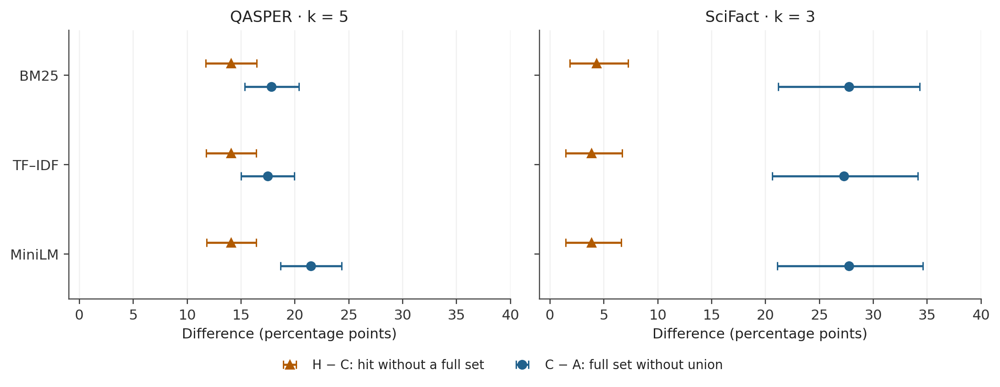

# When Evidence Sets Become Relevance Lists: A Controlled Audit of Scientific Retrieval Evaluation

Yunya Lin — University of Illinois Urbana-Champaign

## Abstract

Evidence benchmarks often retain several annotated sets, yet a flat relevance list cannot express which units are jointly required or which sets are alternatives. We audit the consequences by rescoring fixed lexical and neural rankings on 875 eligible QASPER test questions and 209 SciFact development claim-abstract pairs. At prespecified BM25 budgets, completion of one original set versus the annotated union is 51.0% versus 33.1% in QASPER and 79.4% versus 51.7% in SciFact. The paired gaps are 17.8 percentage points (95% cluster interval 15.3–20.4) and 27.8 points (21.2–34.3). Reaching the union requires a mean 6.65 additional paragraphs or 2.02 additional sentences, although the median penalty is zero in both corpora. Differences persist across lexical and neural rankings. A post-main QASPER check combining matching answer text with minimal-reference pruning reduces the gap to 8.2 points (4.5–12.4). No primary F1 ranking reversal is observed. The study quantifies annotation-completion sensitivity rather than semantic sufficiency or faults in the official evaluators. It supports retaining evidence-set membership and stating the intended aggregation target. An exploratory bounded implementation audit distinguishes unavailable evidence grouping from preserved alternatives and deliberate changes of retrieval task.

## Introduction

A scientific question-answering workflow may export annotated evidence into ordinary query–passage relevance judgments before comparing retrievers. That export can preserve every marked passage while losing which passages were selected together and which selections were alternatives. The practical question is whether the resulting score still measures the outcome that the workflow intends to report.

Suppose one annotation contains paragraphs a and b together, while another contains paragraph c alone. Retrieving a finds evidence but completes neither annotation; retrieving c completes an annotation without covering all marked paragraphs. These outcomes matter when a report moves from “relevant evidence was retrieved” to “the annotated support was recovered.” The distinction depends on the target, not on whether a metric is conventionally named recall.

We measure that difference by holding candidates, eligibility, and rankings fixed, then comparing any annotated hit (H), completion of at least one original set (C), and completion of the annotated union (A). The study includes 875 QASPER test questions and 209 SciFact development claim–abstract pairs, evaluated with three retrieval methods and two controls. It isolates scoring and representation from improvements to retrieval.

At the prespecified BM25 budgets, C and A are 51.0% and 33.1% for QASPER, and 79.4% and 51.7% for SciFact. The paired gaps are 17.8 and 27.8 percentage points. Mean additional union-completion depth is positive, but its median is zero in both corpora. No primary F1 ranking reversal occurs. A post-main QASPER check combining answer agreement and minimal-reference pruning reduces its gap to 8.2 points.

The contribution is the paired measurement of C−A and additional union-completion cost under fixed rankings, together with their decomposition by annotation topology. Earlier work already studies sufficient-set ranking and minimal evidence groups (Alt et al., 2026; Li et al., 2025). We do not introduce complete-set relevance, depth to sufficient evidence, or group-versus-union comparison. An exploratory bounded implementation audit supplies concrete conversion examples without estimating prevalence. The official QASPER and SciFact evaluators preserve alternatives for their relevant objectives.

## Related work and evaluation targets

### Test collections, pooling, and incomplete judgments

The Cranfield paradigm uses documents, information needs, and relevance judgments to compare retrieval systems under controlled conditions. Its value is comparative experimental control, not a claim that one label represents every aspect of user relevance (Voorhees, 2002; Saracevic, 2007). Flat binary or graded qrels support their intended Recall, AP, nDCG, and MRR calculations. Their suitability depends on the task definition and the available judgments. Our result does not make those measures invalid for ordinary document retrieval.

Pooling addresses the cost of finding documents to judge. Zobel’s investigation of large TREC experiments found reasonably reliable relative system comparisons alongside incomplete discovery of relevant documents (Zobel, 1998). Buckley and Voorhees explicitly tested substantial judgment incompleteness and developed bpref, which compares judged relevant and judged nonrelevant documents rather than treating every unjudged document as a known negative (Buckley and Voorhees, 2004). D-MERIT revisits the consequences of partial annotation for retrieval assessment (Rassin et al., 2024).

Those problems concern missing or uncertain unit-level judgments. Our controlled intervention retains every observed annotated unit and removes only the original grouping when forming the union target. It therefore neither corrects incomplete qrels nor assumes that the observed union contains all semantically relevant evidence. Missing relevant units and discarded relationships can coexist, but they are different changes to the evaluation input.

### Dependent relevance, diversity, and information coverage

Beyond Independent Relevance already makes the usefulness of a result depend on other retrieved results. Its subtopic-retrieval formulation uses document-to-subtopic judgments and evaluates coverage of distinct subtopics (Zhai et al., 2003). This directly overlaps with our concern that unit membership alone may be inadequate. The distinction is narrower: subtopic coverage does not, without an additional interpretation, specify that a particular pair of evidence units is jointly required while another unit is an accepted alternative.

Clarke et al. model information nuggets and reduce the marginal gain from repeatedly covered nuggets in alpha-nDCG; this supports novelty and diversity under a ranked-list objective (Clarke et al., 2008). Agrawal et al. define intent-aware measures by evaluating rankings with respect to individual intents and weighting by the intent distribution (Agrawal et al., 2009). These are richer representations than one relevance bit. They could be extended or configured to express evidence requirements, but their usual labels and objectives do not automatically encode the accepted combinations measured by C. Conversely, our exact binary completion endpoint lacks their graded utility, rank discounting, and intent weighting.

Information-unit coverage is also central to TREC question answering. Definition-answer evaluation distinguishes vital and other nuggets, and nugget pyramids aggregate assessor judgments about nugget importance (Voorhees, 2004; Lin and Demner-Fushman, 2006). The TREC 2025 RAG overview describes sub-narrative relevance, nugget-based response completeness, and attribution evaluation (Upadhyay et al., 2026). These precedents prevent treating “coverage beyond a document hit” as a new contribution. Recovering source evidence sets is related to, but not identical with, covering semantic nuggets or verifying generated claims.

### Structured evidence and modern retrieval evaluation

QASPER associates answer annotations with evidence and uses best-reference Evidence F1. SciFact represents sentence rationales and accepts a complete rationale for its abstract-level evidence condition; sentence-level coverage is a different objective. FEVER and FEVEROUS likewise use composite evidence annotations (Dasigi et al., 2021; Wadden et al., 2020; Thorne et al., 2018; Aly et al., 2021). These benchmarks already supply relationships whose retention enables multiple legitimate scoring choices. QASPER answer-writer evidence is not independently certified as a smallest sufficient justification; SciFact rationales are more directly tied to supporting or refuting a claim.

Other modern evaluations ask questions outside exact annotation completion. eRAG studies generator-conditioned retrieval utility; Sufficient Context distinguishes the availability of sufficient context from a model’s ability to use it (Salemi and Zamani, 2024; Joren et al., 2025). Attribute or Abstain studies attribution and abstention, while Document Structure in Long Document Transformers examines structural modeling (Buchmann et al., 2024a; Buchmann et al., 2024b). Ev2R combines reference alignment and verdict-oriented evidence assessment (Akhtar et al., 2026). None licenses interpreting C as semantic sufficiency or as measured downstream answer quality.

### Closest work: sufficient-set ranking and evidence groups

Alt et al. represent multiple gold evidence sets and treat a prefix as sufficient when it contains a complete accepted set. Their Minimal Sufficient Rank measures the earliest sufficient prefix, and they study evidence ordering and reading effort (Alt et al., 2026). Under their gold-set completion criterion, that rank is our dC. Their intervention improves ordering to reach sufficient evidence earlier; ours holds ordering fixed and compares C with A at the same prefixes. Thus complete-set retrieval and depth to one accepted set are precedents, not contributions claimed here.

Li et al. identify minimal evidence groups, discuss union-based annotation labels, and compare group-based and union-based claim reconstruction under word and sentence budgets (Li et al., 2025). The general contrast between an evidence group and its union is therefore also established. Our narrower measurement pairs C and A on every unchanged ranking in two scientific cohorts, decomposes the observed gaps into disjoint annotation topologies, and quantifies the additional depth and tokens needed to complete the union. These costs describe annotated prefixes, not demonstrated savings in human effort.

Recent preprints study conjunctive cross-page evidence and budget-constrained support recovery (Cha et al., 2026; Nguy, 2026). The literature ledger records a final targeted search and full reading of the two close published precedents above. This supports a bounded positioning claim, not an exhaustive novelty claim; search scope and source-access limits are documented in the supplement.

*Representations and the targets they directly support. The distinction is informational, not a claim of metric invalidity or formal novelty.*

| Representation | Documented target | What is still needed for C? |
| --- | --- | --- |
| Flat binary/graded qrels | Recall, AP, nDCG, MRR under their relevance and judgment conventions; H/A from binary union membership. | Accepted combinations cannot generally be recovered from membership alone. |
| Intent or subtopic labels | Intent-weighted utility and coverage of distinct subtopics. | A rule linking labels/units to accepted evidence combinations. |
| Nugget labels and weights | Coverage/importance of information units and redundancy-sensitive gain. | A mapping from semantic coverage to accepted source-evidence combinations. |
| Structured evidence families | H, C, A, and best-reference/union variants, once the target is chosen. | Source validity and semantic sufficiency still require separate evidence. |

## Research questions and formalization

We ask how H, C, and A differ at fixed budgets, what additional prefix cost the union requires, and whether max-reference versus union F1 changes method comparisons. The last question is secondary; demonstrating a ranking reversal is not a success criterion.

Let E_1,...,E_m be nonempty subsets of a document's retrieval units, U their union, and R the retrieved prefix. Define:

$$
H(R)=\mathbf{1}[R\cap U\ne\varnothing],\quad C(R)=\mathbf{1}[\exists j:E_j\subseteq R],\quad A(R)=\mathbf{1}[U\subseteq R].
$$

For every item, A is no larger than C, and C is no larger than H. We call H-C the fragment gap and C-A the union gap. Their nonnegativity is guaranteed by the definitions; we estimate their magnitude and do not test the inequalities as empirical hypotheses. The gaps do not count incorrect answers. H and A are boundary conditions on ordinary union recall: H indicates nonzero recall, and A indicates recall equal to one.

For the family E1={a,b}, E2={c}, the following prefixes separate the three targets. The unannotated unit d is included to make a zero-hit case explicit. These are illustrative calculations, not new empirical observations.

*Illustrative family E1={a,b}, E2={c}. Brackets denote retrieved order; d is unannotated.*

| Retrieved prefix | H | C | A |
| --- | --- | --- | --- |
| [] | 0 | 0 | 0 |
| [a] | 1 | 0 | 0 |
| [a,b] | 1 | 1 | 0 |
| [c] | 1 | 1 | 0 |
| [a,c] | 1 | 1 | 0 |
| [a,b,c] | 1 | 1 | 1 |
| [d] | 0 | 0 | 0 |

### Why flat membership is insufficient

Consider two annotation families, {{a},{b}} and {{a,b}}, with the same union {a,b}. For retrieved set {a}, every metric that sees only retrieved units and flat binary membership receives identical information. Yet C is one for the first family and zero for the second. Thus no function of R and U alone can recover annotation completion for all possible annotation families. This elementary counterexample identifies the lost information; it is not claimed as a new theory of relevance. Flattening does not itself require an evaluator to use A; it removes the grouping information needed to recover C from flat membership alone.

Duplicate sets do not change H, C, or A. Removing a strict superset of another reference preserves C but can shrink U, changing H and A. We call a set minimal within the observed family if no other observed reference is its strict subset. This is an order-theoretic property of annotations, not a semantic assertion that every sentence in the remaining set is necessary.

### Ranked completion and budget

Let rank(e) be a unit's one-based position in a complete ranking. The first depth completing one reference and the depth completing the union are:

$$
d_C=\min_j\max_{e\in E_j}\operatorname{rank}(e),\qquad d_A=\max_{e\in U}\operatorname{rank}(e),\qquad \Delta d=d_A-d_C.
$$

Under Alt et al.’s gold-set criterion, dC is Minimal Sufficient Rank (Alt et al., 2026). Here the contrast of interest is dA−dC. Its token counterpart subtracts cumulative lexical-token costs at the two depths. These are annotation-defined oracle stopping depths, unavailable to a deployed retriever; they are not measured inference charges or avoidable real-world costs.

We also report union recall and max-reference recall, and two F1 definitions:

$$
F_{1,\max}(R)=\max_j\frac{2|R\cap E_j|}{|R|+|E_j|},\qquad F_{1,U}(R)=\frac{2|R\cap U|}{|R|+|U|}.
$$

Unlike the binary completion endpoints, the two F1 scores have no universal order. A union can increase both the number of matched units and the reference denominator. Exact best-reference F1 is appropriate to compare with the QASPER implementation; these retrieval-only scores are not the full official task scores.

## Data and experimental design

### QASPER cohort

We use QASPER v0.3 test, containing 1451 questions in 416 papers. Candidate units are nonempty full-text paragraphs; whitespace-normalized duplicate paragraphs collapse to one content unit. A question is retained only when every answer annotation is answerable and has nonempty, wholly mappable textual evidence. Any figure/table marker, missing evidence, or unmapped textual evidence excludes the whole question. We do not remove an inconvenient piece of a reference while retaining the rest.

This yields 875 questions from 367 papers. The strict cohort excludes 576 questions. Overlapping exclusion reasons comprise 253 with figure/table evidence, 288 with empty evidence, 243 with an unanswerable annotation, and 89 with unmapped text. These counts overlap; the accompanying eligibility CSV records an alphabetical first-reason hierarchy separately. Results cannot be generalized without qualification to all QASPER questions, especially multimodal and disputed-answer items.

### SciFact cohort

We use the official SciFact development release downloaded on 3 October 2026 UTC. Its 300 claims include 188 with evidence and 112 without evidence. The evidence-bearing claims produce 209 eligible claim-abstract pairs. Candidate units are all sentences within the known gold abstract. Every rationale must be nonempty, in range, and consistently labelled with the other rationales for that pair.

The abstract is supplied, so this experiment evaluates rationale retrieval rather than discovering relevant abstracts or predicting scientific verdicts. We preserve sentence identifiers and do not collapse distinct positions. Claim-abstract pairs sharing either a claim or an abstract form connected components for statistical resampling, yielding 164 groups. No-evidence claims are not eligible pairs, and their counts must not be subtracted directly from the pair denominator.

The acquired SciFact release contains up to 6 rationales per pair, beyond the original paper’s description of up to three. We analyze those acquired annotations; the supplement identifies the pinned archive.

*Source and analysis denominators. QASPER exclusion reasons overlap; SciFact claims and claim-abstract pairs are different units.*

| Quantity | QASPER test | SciFact dev |
| --- | --- | --- |
| Source questions / claims | 1451 | 300 |
| Source papers | 416 | Known abstract supplied |
| Eligible questions / pairs | 875 | 209 |
| Resampling clusters | 367 | 164 |
| Multiple distinct evidence sets | 472 | 85 |
| Multiple minimal evidence sets | 285 | 85 |
| No singleton reference | 127 | 14 |
| Exact answer agreement | 195 | Consistent rationale labels |

### Pilot and frozen design

A disjoint pilot contained 88 eligible QASPER development questions and 47 SciFact training items. Inclusion rules, metrics, models, and analysis were then frozen locally; this was not public preregistration. No retriever was tuned on either main cohort. The saved experiment contains 5420 full rankings and 32520 unit-budget scoring points. Source-access chronology and computational provenance are recorded in the supplement.

### Retrieval methods

BM25 uses k1=1.2 and b=0.75, with within-document inverse document frequencies and positive IDF log(1+(N-df+0.5)/(df+0.5)). Query terms are deduplicated and sorted before summation. The implementation follows the probabilistic relevance model family (Robertson and Zaragoza, 2009), with this variant stated explicitly. TF-IDF uses word unigrams, smoothed IDF, L2 normalization, and cosine similarity. Both lexical methods tokenize lowercase Unicode word sequences without stop-word removal.

The neural method is sentence-transformers/all-MiniLM-L6-v2, with the official model revision and weights pinned in the supplement. It uses ONNX weights, attention-mask mean pooling, L2 normalization, and cosine similarity, truncating inputs to 256 wordpieces including special tokens. CPU inference uses batches of 16 and two intra-operation threads. MiniLM is a robustness instrument, not a state-of-the-art or uncontaminated scientific-retrieval benchmark; scientific pretraining overlap is possible.

Lead-position and deterministic random rankings provide controls. Random scores use a per-item seed derived from the fixed seed, corpus, and item ID, giving one reproducible permutation per item. Ties in all methods resolve by original unit order. Full rankings are saved. The same ranking is reused for every scoring rule, preventing retrieval variation from confounding the comparison.

### Budgets, estimands, and uncertainty

Primary comparisons are BM25 at five paragraphs for QASPER and three sentences for SciFact. Curves report k=1, 2, 3, 5, 10, 20. Prefixes saturate at document length; the denominator remains all eligible items. Supplementary lexical-token budgets are 64, 128, 256, 512, 1024, 2048. A token-bounded prefix stops before the first complete unit that would exceed its budget; it does not skip or truncate that unit. Lexical tokens differ from the encoder's wordpieces, and equal token budgets across corpora do not imply equal tasks.

For each corpus separately, we estimate item-weighted means and 95% percentile cluster-bootstrap intervals using 10,000 replicates and seed 20261002. Each replicate samples observed clusters with replacement and divides summed item outcomes by the resulting number of sampled items. The same cluster weights are used for paired scores and method contrasts. Unequal cluster sizes are therefore retained rather than averaging cluster means with equal weight.

The main sample is a census of eligible benchmark items, not a probability sample of scientific information needs. Intervals quantify stability under resampling the observed paper or connected-component structure. They do not capture annotation error, benchmark selection, or population representativeness. We report no p-values for deterministic inequalities. Exploratory method contrasts use pointwise intervals without multiplicity-adjusted significance claims, and no statistically established ranking reversal is asserted.

### Robustness and implementation validation

Prespecified sensitivities cover answer agreement, superset pruning, 100 deterministic single-reference selections, neural versus lexical rankings, token versus unit budgets, and corpus-specific dependence. Single-reference selection deliberately changes the accepted family; it is not improved gold.

The joint answer-agreement/minimal-reference check, direct-bootstrap validation, disjoint topology decomposition, implementation sample, and result-blind modern-encoder timing gate are post-main additions. Their analyses are explicitly exploratory. They do not alter the frozen cohorts, rankings, budgets, or primary analyses.

## Results

### Cohort structure

The observed annotation families differ substantially. QASPER has 472 items with multiple distinct sets, but only 285 with multiple minimal sets: nested annotations account for part of its multiplicity. SciFact has 85 items with multiple distinct sets, and none of its distinct rationales overlap within an item. Thus the two corpora provide different structural settings rather than interchangeable replications.

Only 127 QASPER questions and 14 SciFact pairs lack a singleton reference. A small fragment gap is consequently unsurprising in SciFact: whenever a retrieved annotated singleton is itself a full rationale, H and C coincide. The more consequential issue there is treating several acceptable rationales as one mandatory union. This topology is a mechanism for the result, not a confound to be statistically removed.

### Fixed-budget completion gaps

At the primary QASPER budget, BM25 attains H=65.0%, C=51.0%, and A=33.1%. The fragment gap is 14.1 percentage points (95% cluster interval 11.7 to 16.4); the union gap is 17.8 points (15.3 to 20.4). At the primary SciFact budget, H=83.7%, C=79.4%, and A=51.7%. Its fragment gap is 4.3 points (1.8 to 7.2), and its union gap is 27.8 points (21.2 to 34.3). These are paired differences for exactly the same retrieved prefixes.

*Fixed-budget outcomes on the full eligible cohorts. H: any annotated hit; C: one completed set; A: completed union. C−A uses paired 95% cluster intervals. Lead and random are controls.*

| Corpus / k | Method | H (%) | C (%) | A (%) | C−A, pp [95% interval] |
| --- | --- | --- | --- | --- | --- |
| QASPER / 5 | BM25 | 65.0 | 51.0 | 33.1 | 17.8 [15.3, 20.4] |
| QASPER / 5 | TF-IDF | 62.7 | 48.7 | 31.2 | 17.5 [15.0, 20.0] |
| QASPER / 5 | MiniLM | 68.9 | 54.9 | 33.4 | 21.5 [18.6, 24.3] |
| QASPER / 5 | Lead | 23.4 | 17.9 | 7.3 | 10.6 [8.4, 12.9] |
| QASPER / 5 | Random | 26.6 | 16.1 | 6.6 | 9.5 [7.5, 11.5] |
| SciFact / 3 | BM25 | 83.7 | 79.4 | 51.7 | 27.8 [21.2, 34.3] |
| SciFact / 3 | TF-IDF | 79.9 | 76.1 | 48.8 | 27.3 [20.6, 34.1] |
| SciFact / 3 | MiniLM | 82.3 | 78.5 | 50.7 | 27.8 [21.1, 34.6] |
| SciFact / 3 | Lead | 26.3 | 22.0 | 13.9 | 8.1 [4.3, 12.6] |
| SciFact / 3 | Random | 61.7 | 54.5 | 31.6 | 23.0 [16.9, 29.0] |

Figure 1 shows that the distinctions persist across budgets and eventually narrow as prefixes approach complete documents. SciFact reaches high completion at shorter unit budgets because it searches within short abstracts. Its apparent advantage must not be interpreted as a corpus-level comparison of retrieval difficulty: the tasks, candidate sets, and unit sizes differ. Long-list saturation is included rather than dropping short documents at large k.

BM25 completion curves. Shaded bands are 95% cluster-bootstrap intervals. The same prefixes are scored under all three definitions. Units are paragraphs for QASPER and sentences for SciFact; large k saturates at document length.

The union gap also appears under TF-IDF and MiniLM (Figure 2). For QASPER, MiniLM yields C=54.9% and A=33.4%; for SciFact, the rates are 78.5% and 50.7%. The result therefore does not depend on one lexical scoring formula. Controls have lower completion but can still exhibit aggregation gaps, because the relationships follow the annotations and retrieved prefixes rather than a model class.

Paired score gaps at the primary budgets: QASPER k=5 and SciFact k=3. Whiskers show 95% cluster intervals. The definitions guarantee nonnegative gaps; their magnitudes are the empirical quantities.

### Additional ranked budget

For BM25, reaching the union instead of one original set requires an average of 6.65 extra QASPER paragraphs (95% interval 5.69 to 7.70) and 2.02 extra SciFact sentences (1.48 to 2.63). The corresponding average additional lexical tokens are 540.9 and 58.5. These means pool all eligible items within each corpus, including items whose penalty is zero.

The distributions are strongly heterogeneous. The median additional depth is zero in both corpora; 54.9% of QASPER items and 59.3% of SciFact items incur no BM25 depth penalty. A minority with divergent reference locations produces the positive mean. The cost table reports dispersion and uncertainty, and the cumulative distributions in Supplement section 1 expose the zero mass and long tail. Reporting only mean cost would imply a more universal penalty than the data support.

*Extra fixed-ranking prefix budget required for the union instead of one original reference. Means have 95% cluster intervals; depth medians have interquartile ranges. Lexical tokens are not encoder wordpieces.*

| Corpus | Method | Extra units: mean [CI] | Median [IQR] | Extra tokens: mean [CI] |
| --- | --- | --- | --- | --- |
| QASPER | BM25 | 6.65 [5.69, 7.70] | 0 [0, 7] | 540.9 [463.7, 624.0] |
| QASPER | TFIDF | 6.61 [5.67, 7.63] | 0 [0, 8] | 540.9 [463.7, 623.8] |
| QASPER | MiniLM | 6.22 [5.41, 7.09] | 0 [0, 8] | 509.3 [440.3, 581.4] |
| SciFact | BM25 | 2.02 [1.48, 2.63] | 0 [0, 3] | 58.5 [43.0, 76.3] |
| SciFact | TFIDF | 2.04 [1.51, 2.63] | 0 [0, 3] | 59.5 [43.9, 77.0] |
| SciFact | MiniLM | 1.87 [1.33, 2.53] | 0 [0, 3] | 54.6 [39.4, 72.7] |

### Exploratory topology decomposition

An exploratory post-main decomposition partitions each cohort into four disjoint categories after deduplicating identical sets: one distinct set; several sets with one minimal set; several minimal sets without supersets; and several minimal sets with supersets. “Minimal” means no strict subset occurs in the observed family. It does not certify semantic necessity. The category counts are 403, 187, 243, and 42 for QASPER, and 124, 0, 85, and 0 for SciFact.

*Exploratory post-main, mutually exclusive topology strata at BM25 primary budgets. n/g gives items/represented clusters. Gap and full-cohort contribution are percentage points with 95% cluster intervals; represented clusters can overlap across strata. Empty categories are shown explicitly.*

| Corpus and category | n/g | C−A, pp [CI] | Contribution, pp [CI] |
| --- | --- | --- | --- |
| QASPER: One distinct set | 403/246 | 0.0 [0.0, 0.0] | 0.00 [0.00, 0.00] |
| QASPER: Multiple sets, one minimal | 187/145 | 27.8 [21.6, 34.4] | 5.94 [4.42, 7.59] |
| QASPER: Multiple minimal, no supersets | 243/180 | 36.2 [30.6, 42.2] | 10.06 [8.13, 12.05] |
| QASPER: Multiple minimal plus supersets | 42/33 | 38.1 [22.0, 54.8] | 1.83 [0.89, 2.92] |
| SciFact: One distinct set | 124/102 | 0.0 [0.0, 0.0] | 0.00 [0.00, 0.00] |
| SciFact: Multiple sets, one minimal | 0/0 | — | 0 (empty) |
| SciFact: Multiple minimal, no supersets | 85/70 | 68.2 [57.8, 77.9] | 27.75 [21.20, 34.30] |
| SciFact: Multiple minimal plus supersets | 0/0 | — | 0 (empty) |

One distinct set forces C−A=0. QASPER’s four contributions are 0.00, 5.94, 10.06, and 1.83 percentage points, each obtained by multiplying its stratum mean by its cohort fraction. They reconstruct the 17.83-point overall gap before rounding. The two multiple-minimal-set categories account for most of that gap, while nested families with one minimal set contribute another 5.94 points. SciFact’s entire 27.75-point gap comes from its 85 pairs with multiple minimal sets. This identifies where flattening matters in the observed annotations; it does not estimate the causal effect of collecting another annotation.

*Exploratory post-main completion costs in each populated topology category. Values are mean additional ranked units and lexical tokens with 95% cluster intervals. Units are QASPER paragraphs or SciFact sentences; category denominators are in the preceding table.*

| Corpus and category | Extra units [CI] | Extra lexical tokens [CI] |
| --- | --- | --- |
| QASPER: One distinct set | 0.00 [0.00, 0.00] | 0.0 [0.0, 0.0] |
| QASPER: Multiple sets, one minimal | 10.18 [8.02, 12.49] | 783.3 [629.2, 946.5] |
| QASPER: Multiple minimal, no supersets | 12.66 [10.82, 14.63] | 1047.2 [907.9, 1201.2] |
| QASPER: Multiple minimal plus supersets | 20.05 [14.20, 26.64] | 1721.7 [1177.5, 2342.5] |
| SciFact: One distinct set | 0.00 [0.00, 0.00] | 0.0 [0.0, 0.0] |
| SciFact: Multiple minimal, no supersets | 4.96 [4.05, 6.12] | 143.9 [117.4, 178.4] |

Within-stratum intervals resample represented papers or connected components and retain item weights. Contribution intervals instead resample the full cohort with outcomes outside the category set to zero. All methods, depth and token contributions, and BM25 modifiers for singleton availability and QASPER answer agreement are in the machine-readable supplement. Empty cells remain empty; cells with fewer than ten represented clusters are flagged sparse. No new predictive model is fitted.

### F1 and comparisons among retrieval methods

Large completion differences need not produce large average F1 differences. QASPER BM25 max-reference F1 is 0.227, while union F1 is 0.228; SciFact values are 0.421 and 0.434. The larger union F1 in these BM25 settings illustrates why it cannot be assumed to fall below best-reference F1. The binary endpoints and continuous overlap scores answer different questions.

The ordering of BM25, TF-IDF, and MiniLM does not reverse between max-reference and union F1 at the primary budgets. We therefore do not claim a demonstrated ranking reversal. Aggregation does change the magnitude of some contrasts: MiniLM's QASPER completion advantage over BM25 is 3.9 points under C and 0.2 under A. These comparisons are exploratory, and their pointwise intervals are retained in the results package rather than used to declare an unadjusted significance finding.

## Robustness and error analysis

### Answer agreement, nesting, and annotation count

For answer agreement, each annotation is serialized as its ordered extractive spans joined with comma-space, otherwise its nonempty free-form answer, otherwise “yes” or “no” when specified. The string is lowercased, ASCII punctuation is deleted, the whole-word articles “a,” “an,” and “the” are removed, and whitespace is collapsed and trimmed. Unicode and non-ASCII punctuation are not normalized. An item is retained only if all annotations yield exactly the same string.

Exact normalized answer agreement holds for 195 QASPER questions. Restricting to those items reduces the BM25 union gap from 17.8 to 12.3 points. Pruning redundant supersets on the full cohort reduces it to 11.8 points while preserving C exactly. Both changes therefore explain part of the original difference. This is evidence against interpreting the full QASPER gap as exclusively disagreement-free, nonnested alternatives.

The post-main joint sensitivity applies both restrictions. Its union gap is 8.2 points (95% interval 4.5 to 12.4) across 195 questions in 149 papers. A residual discrepancy remains, but the smaller magnitude is the appropriate bound for this more restrictive interpretation. SciFact is unchanged because all retained rationales are consistently labelled, distinct, and nonoverlapping.

*QASPER union-gap sensitivities at k=5. Rows use BM25 unless indicated. The joint restriction is post-main and exploratory.*

| Restriction | n | C−A, pp [95% interval] |
| --- | --- | --- |
| Exact answer agreement | 195 | 12.3 [7.8, 17.1] |
| Minimal-reference pruning | 875 | 11.8 [9.7, 13.9] |
| MiniLM: no gold truncation | 750 | 20.4 [17.4, 23.4] |
| Agreement + minimal sets (exploratory) | 195 | 8.2 [4.5, 12.4] |

Selecting one reference per item forces C and A to coincide, as expected, but also discards valid observed alternatives. Across 100 deterministic selections, BM25 one-reference completion averages 42.0% for QASPER and 64.9% for SciFact, compared with 51.0% and 79.4% when any original reference may be completed. The range across selections is a diagnostic of reference choice, not a confidence interval. Choosing one reference is therefore not a neutral repair for flattening.

### Neural truncation and token budgets

No query is truncated by MiniLM. At least one candidate unit is truncated in 556 QASPER items, and annotated evidence is truncated in 125. SciFact has one item with a truncated candidate sentence and none with truncated gold evidence. Excluding QASPER items with truncated gold leaves 750 items; the MiniLM union gap remains 20.4 points. This sensitivity does not remove all effects of truncating nongold candidates, which can still influence rankings.

Supplementary token budgets admit complete prefixes without skipping an oversized next unit; this can yield an empty prefix. BM25 at 512 lexical tokens gives C=50.2% and A=31.4% in QASPER; at 64 tokens it gives C=63.2% and A=37.3% in SciFact. These are descriptive examples. SciFact saturates at 1024 tokens; QASPER remains incomplete at 2048. Equal token budgets do not equalize the tasks.

### Exploratory presentation of preselected cases

The panels present one preselected BM25 case per corpus in which C=1 and A=0. They show the exact evidence family and retrieved prefix, rather than treating a textual rationale as sufficient by inspection. The supplement records deterministic selection and all error-category counts; these cases are illustrations, not representative-sample estimates.

*Exploratory case panel: QASPER. Preselected BM25 example; all unit indices are zero-based and refer to the released source mapping.*

| Field | Recorded example |
| --- | --- |
| Source IDs | Paper 1909.12208; question 14fdc8087f2a62baea9d50c4aa3a3f8310b38d17 |
| Question / claim | What supports the claim that enhancement in training is advisable as long as enhancement in test is at least as strong as in training? |
| Evidence family | E1={17,22,23,34}; E2={23} |
| Exact retrieved prefix | [34,1,2,23,3] at k=5 |
| Scores | H=1; C=1; A=0 |
| Completion depths | dC=4; dA=23; extra depth=19 |
| Interpretation | Paragraph 23 alone completes a selected annotation. The longer reference also contains 17, 22, and 34. Answers disagree under normalization; this case illustrates nesting and should not be read as agreement-free alternative support. |

*Exploratory case panel: SciFact. Preselected BM25 example; all unit indices are zero-based and refer to the released source mapping.*

| Field | Recorded example |
| --- | --- |
| Source IDs | Claim 873; abstract 1180972 |
| Question / claim | Obesity is determined solely by environmental factors. |
| Evidence family | E1={3,4}; E2={6}; E3={7} |
| Exact retrieved prefix | [7,0,1] at k=3 |
| Scores | H=1; C=1; A=0 |
| Completion depths | dC=1; dA=8; extra depth=7 |
| Interpretation | Sentence 7 alone is a complete annotated rationale. The other observed rationales contain {3,4} and {6}. The source statement concerns genetic influences on obesity; completion is not an endorsement of the claim’s wording. |

### Numerical validation

A separate arithmetic verifier recomputed all 5420 rankings' costs and all 32520 scoring points without calling the production scoring function. It reconstructed every included QASPER reference from the original source, checked shared SciFact claims/documents against cluster IDs, and verified all frozen input and code hashes. The separately implemented direct-resampling check reproduced primary interval endpoints within 0.08 percentage points of the production bootstrap using a different seed.

Tests cover scorer parity, padding, invalid inputs, interrupted checkpoints, cluster arithmetic, conversion fixtures, and topology edge cases. Additional internal validation checks test the saved results and their presentation. These checks are not independent replication or peer review.

## Exploratory implementation audit

### Bounded sample and representation classes

A written protocol preceded inspection of additional implementation behavior; prior familiarity with the official evaluators was disclosed. A bounded GitHub and Hugging Face search combined each benchmark name with four neutral loader, evaluation, conversion, and RAG phrases. Fifteen eligible downstream implementation families per benchmark were inspected after lineage deduplication and deterministic selection. Official evaluators and their dataset distributions serve as separate reference cases. The supplement retains search coverage, exclusions, eligibility uncertainty, and selection corrections.

Representations were classified as preserved (grouping retained), flat only (unit membership without grouping), both exposed (grouped and aggregated paths), other/not applicable (a different task or granularity), or undetermined. Nested lists can preserve alternatives without explicit set IDs. Pinned source-to-output tracing and six isolated conversion fixtures support classification; full downstream model pipelines were not executed. A second consistency pass checked the same source records, without independent human annotation. Search indexing, screening, lineage uncertainty, and the inspection cap limit generalization.

*Exploratory bounded downstream implementation sample. Counts describe fifteen selected families per benchmark, not population prevalence. The two official evaluator reference families are excluded and retain alternatives for their relevant objectives.*

| Representation class | QASPER | SciFact |
| --- | --- | --- |
| Preserved | 0 | 1 |
| Flat only | 2 | 0 |
| Both exposed | 3 | 1 |
| Other / not applicable | 9 | 13 |
| Undetermined | 1 | 0 |
| Total inspected | 15 | 15 |

### What the inspected representations show

Two QASPER families expose flat-only representations: the sscc-rag-paper paragraph-qrels loader and the mteb/QASPER distribution. A fixture for the former maps two distinct, fully mappable evidence families to identical qrels while preserving all fixture units. The latter exposes passage qrels without reference linkage, but does not uniformly equal the source’s annotated union. Thus it demonstrates unavailable grouping, not a verified pure union conversion on every item; source-to-distribution checks are in the supplement.

CGSN, DEFT, and the VikingRAG/OpenViking lineage expose grouped and aggregated QASPER paths. The sampled BigBio SciFact distribution preserves rationale groups; another family retains structured claims beside a flattened-sentence helper. Thirteen SciFact families use document-level qrels, query-only distributions, or changed tasks and are not sentence-rationale flattening cases. One QASPER context-list distribution remains undetermined because its conversion is unavailable.

The reference evaluators preserve alternatives for their stated objectives. These findings support a concrete conversion risk and the value of inspecting source-to-score paths; they do not establish widespread defects, the prevalence of the exact intervention, or inappropriate use of standard IR metrics. The controlled experiment remains a measurement-sensitivity warning even where practical flattening is uncommon.

## Discussion

### What the audit establishes

The controlled intervention changes an evaluation target without adding or deleting observed evidence units. Annotation multiplicity determines where differences are possible; rankings determine whether they occur at a budget and their prefix costs. Their observed magnitude and distribution are the empirical contribution.

The union target is harder by construction. Our measurements characterize that change; they do not reinterpret it as model failure. A deliberately exhaustive task may choose A, while one-rationale completion requires the original family. Best-reference scoring can favor the easiest annotation, and semantic evaluators may accept unannotated support. No one target is universally preferable.

### Implications for information representation and evaluation

An export intended to support C should retain query and source-unit identity together with evidence-family membership and annotation provenance. Nested lists are sufficient; an explicit set-ID column is optional. Reports should identify the aggregation target and describe distinct/minimal sets, singleton availability, eligibility, and exclusions. A flat export remains suitable when its intended objective requires only flat relevance.

### Limits of transfer

The implementation sample includes preserved families, unavailable grouping, and deliberate changes of task. It supplies no population prevalence estimate, downstream answer outcome, or user-benefit measurement.

MiniLM is small and may have encountered related scientific text during pretraining. A prespecified feasibility gate prevented the planned Qwen3-Embedding-0.6B robustness run (Qwen Team, 2025); robustness to a stronger contemporary encoder remains untested (Supplement section 3). Larger models may change the observed gaps but cannot reconstruct grouping from flat membership alone. One seeded random ranking per item serves only as a control, not a stochastic performance estimate.

## Limitations, ethics, and disclosure

The strongest limitation is the distance between annotated coverage and semantic sufficiency. Source annotations can be incomplete, nonminimal, or inconsistent; exact answer normalization is a conservative textual test rather than a semantic audit. Removing nested supersets changes the union target, and single-reference selection discards alternatives. We report those transformations as sensitivities, not newly validated gold labels.

The strict QASPER cohort represents only 60.3% of test questions. SciFact conditions on an evidence-bearing claim and known gold abstract. Both corpora involve scientific text in English, and neither samples all scientific information-seeking situations. Cluster intervals address observed dependence, not these selection mechanisms. The counterfactual score differences are exact for the saved rankings; their broader importance requires judgment about the intended task.

Only public benchmarks, implementations, and model weights were used. No participants were recruited, private records collected, or new human judgments created. No institutional ethics approval is claimed. The release documents third-party terms and acquisition rather than redistributing source-paper collections or model weights.

Generative AI tools (OpenAI Codex) supported grammar checking, language refinement, clarity, and organization. The author conceived the study, made the substantive methodological and interpretive decisions, conducted and verified the research, and wrote the substantive content. Under the author’s direction, tool assistance also supported code edits, reruns, numerical and reference checks, and preparation of figures and manuscript files. The author reviewed AI-assisted material and takes responsibility for the final work. AI is not an author. MiniLM was a retrieval encoder; Qwen was used only for the timing gate. No LLM generated experimental answers or served as the ground-truth judge.

## Conclusion

In two scientific retrieval settings, finding annotated evidence, completing one original evidence set, and exhausting all annotated units give materially different assessments of the same rankings. BM25's union gaps are 17.8 points for QASPER and 27.8 points for SciFact at the prespecified budgets. The stricter QASPER joint sensitivity reduces the gap to 8.2 points, showing that answer variation and nesting explain part, but not all, of that discrepancy.

The gap is structurally concentrated: one distinct set gives no difference, and SciFact’s gap arises entirely among pairs with multiple minimal sets. Median additional depth remains zero in both corpora, and no primary F1 ranking reversal was observed. The bounded implementation sample shows preserved and inapplicable cases alongside flat outputs. The practical implication is to retain evidence-family relationships when the objective needs them and state the chosen aggregation target explicitly. This is a controlled measurement result, not a semantic-sufficiency test or a claim of ecosystem-wide evaluation failure.

## Acknowledgments and disclosure of funding

No external funding or third-party computational resources were received or used for this work. All computational experiments were conducted locally on the author’s personal computer.

## Data and code availability

The reproducibility repository is available at https://github.com/YoyoLin008/evidence-sets-retrieval-evaluation. The immutable submission-time release v1.0.0 is archived on Zenodo at https://doi.org/10.5281/zenodo.23122620. It contains frozen plans and source snapshots, acquisition URLs and hashes, retrieval and analysis code, saved rankings, eligibility/mapping audits, and manuscript generators. Primary and post-main exploratory outputs are separated. Third-party datasets and model weights are not redistributed; acquisition instructions and hashes identify the original sources.

## References

Pradeep Dasigi, Kyle Lo, Iz Beltagy, Arman Cohan, Noah A. Smith, Matt Gardner. (2021). A Dataset of Information-Seeking Questions and Answers Anchored in Research Papers. Proceedings of the 2021 Conference of the North American Chapter of the Association for Computational Linguistics: Human Language Technologies, pp. 4599–4610. [10.18653/v1/2021.naacl-main.365](https://aclanthology.org/2021.naacl-main.365/)

David Wadden, Shanchuan Lin, Kyle Lo, Lucy Lu Wang, Madeleine van Zuylen, Arman Cohan, Hannaneh Hajishirzi. (2020). Fact or Fiction: Verifying Scientific Claims. Proceedings of the 2020 Conference on Empirical Methods in Natural Language Processing (EMNLP), pp. 7534–7550. [10.18653/v1/2020.emnlp-main.609](https://aclanthology.org/2020.emnlp-main.609/)

James Thorne, Andreas Vlachos, Christos Christodoulopoulos, Arpit Mittal. (2018). FEVER: a Large-scale Dataset for Fact Extraction and VERification. Proceedings of the 2018 Conference of the North American Chapter of the Association for Computational Linguistics: Human Language Technologies, Volume 1 (Long Papers), pp. 809–819. [10.18653/v1/N18-1074](https://aclanthology.org/N18-1074/)

Rami Aly, Zhijiang Guo, Michael Sejr Schlichtkrull, James Thorne, Andreas Vlachos, Christos Christodoulopoulos, Oana Cocarascu, Arpit Mittal. (2021). The Fact Extraction and VERification Over Unstructured and Structured information (FEVEROUS) Shared Task. Proceedings of the Fourth Workshop on Fact Extraction and VERification (FEVER), pp. 1–13. [10.18653/v1/2021.fever-1.1](https://aclanthology.org/2021.fever-1.1/)

Royi Rassin, Yaron Fairstein, Oren Kalinsky, Guy Kushilevitz, Nachshon Cohen, Alexander Libov, Yoav Goldberg. (2024). Evaluating D-MERIT of Partial-annotation on Information Retrieval. Proceedings of the 2024 Conference on Empirical Methods in Natural Language Processing, pp. 2913–2932. [10.18653/v1/2024.emnlp-main.171](https://aclanthology.org/2024.emnlp-main.171/)

Jan Buchmann, Xiao Liu, Iryna Gurevych. (2024a). Attribute or Abstain: Large Language Models as Long Document Assistants. Proceedings of the 2024 Conference on Empirical Methods in Natural Language Processing, pp. 8113–8140. [10.18653/v1/2024.emnlp-main.463](https://aclanthology.org/2024.emnlp-main.463/)

Jan Buchmann, Max Eichler, Jan-Micha Bodensohn, Ilia Kuznetsov, Iryna Gurevych. (2024b). Document Structure in Long Document Transformers. Proceedings of the 18th Conference of the European Chapter of the Association for Computational Linguistics (Volume 1: Long Papers), pp. 1056–1073. [10.18653/v1/2024.eacl-long.64](https://aclanthology.org/2024.eacl-long.64/)

Alireza Salemi, Hamed Zamani. (2024). Evaluating Retrieval Quality in Retrieval-Augmented Generation. Proceedings of the 47th International ACM SIGIR Conference on Research and Development in Information Retrieval, pp. 2395-2400. [10.1145/3626772.3657957](https://doi.org/10.1145/3626772.3657957)

Mubashara Akhtar, Michael Schlichtkrull, Andreas Vlachos. (2026). Ev2R: Evaluating Evidence Retrieval in Automated Fact-Checking. Transactions of the Association for Computational Linguistics, 14, pp. 530-561. [10.1162/tacl.a.647](https://aclanthology.org/2026.tacl-1.25/)

Hailey Joren, Jianyi Zhang, Chun-Sung Ferng, Da-Cheng Juan, Ankur Taly, Cyrus Rashtchian. (2025). Sufficient Context: A New Lens on Retrieval Augmented Generation Systems. International Conference on Learning Representations, pp. 20310–20334. [Source](https://proceedings.iclr.cc/paper_files/paper/2025/hash/33dffa2e3d2ab74a783d1a8c292f66d9-Abstract-Conference.html)

Sungguk Cha, DongWook Kim, Mintae Kim, Youngsub Han, Byoung-Ki Jeon, Sangyeob Lee. (2026). Do Current Retrievers Cover All the Evidence? A Controlled Study of Conjunctive Cross-Page Retrieval. arXiv preprint 2607.24165v2. [10.48550/arXiv.2607.24165](https://arxiv.org/abs/2607.24165v2)

Thomson D. Nguy. (2026). More Context, Same Budget: Dual-Bounded Relational Recall Beyond Top-K Retrieval. arXiv preprint 2608.18448v1. [10.48550/arXiv.2608.18448](https://arxiv.org/abs/2608.18448v1)

Stephen Robertson, Hugo Zaragoza. (2009). The Probabilistic Relevance Framework: BM25 and Beyond. Foundations and Trends in Information Retrieval, 3(4), pp. 333–389. [10.1561/1500000019](https://doi.org/10.1561/1500000019)

Tefko Saracevic. (2007). Relevance: A review of the literature and a framework for thinking on the notion in information science. Part II: nature and manifestations of relevance. Journal of the American Society for Information Science and Technology, 58(13), pp. 1915–1933. [10.1002/asi.20682](https://doi.org/10.1002/asi.20682)

Ellen M. Voorhees. (2002). The Philosophy of Information Retrieval Evaluation. Evaluation of Cross-Language Information Retrieval Systems. Lecture Notes in Computer Science, volume 2406, pp. 355-370. [10.1007/3-540-45691-0_34](https://doi.org/10.1007/3-540-45691-0_34)

Justin Zobel. (1998). How Reliable are the Results of Large-Scale Information Retrieval Experiments? Proceedings of the 21st Annual International ACM SIGIR Conference on Research and Development in Information Retrieval, pp. 307-314. [10.1145/290941.291014](https://doi.org/10.1145/290941.291014)

Chris Buckley, Ellen M. Voorhees. (2004). Retrieval Evaluation with Incomplete Information. Proceedings of the 27th Annual International ACM SIGIR Conference on Research and Development in Information Retrieval, pp. 25-32. [10.1145/1008992.1009000](https://tsapps.nist.gov/publication/get_pdf.cfm?pub_id=150469)

Cheng Xiang Zhai, William W. Cohen, John Lafferty. (2003). Beyond Independent Relevance: Methods and Evaluation Metrics for Subtopic Retrieval. Proceedings of the 26th Annual International ACM SIGIR Conference on Research and Development in Information Retrieval, pp. 10-17. [10.1145/860435.860440](https://doi.org/10.1145/860435.860440)

Charles L. A. Clarke, Maheedhar Kolla, Gordon V. Cormack, Olga Vechtomova, Azin Ashkan, Stefan Büttcher, Ian MacKinnon. (2008). Novelty and Diversity in Information Retrieval Evaluation. Proceedings of the 31st Annual International ACM SIGIR Conference on Research and Development in Information Retrieval, pp. 659-666. [10.1145/1390334.1390446](https://doi.org/10.1145/1390334.1390446)

Rakesh Agrawal, Sreenivas Gollapudi, Alan Halverson, Samuel Ieong. (2009). Diversifying Search Results. Proceedings of the Second ACM International Conference on Web Search and Data Mining, pp. 5-14. [10.1145/1498759.1498766](https://doi.org/10.1145/1498759.1498766)

Ellen M. Voorhees. (2004). Overview of the TREC 2003 Question Answering Track. Proceedings of the Twelfth Text REtrieval Conference (TREC 2003), NIST Special Publication 500-255, pp. 54–68. [Source](https://trec.nist.gov/pubs/trec12/papers/QA.OVERVIEW.pdf)

Jimmy Lin, Dina Demner-Fushman. (2006). Will Pyramids Built of Nuggets Topple Over? Proceedings of the Human Language Technology Conference of the NAACL, Main Conference, pp. 383–390. [Source](https://aclanthology.org/N06-1049/)

Shivani Upadhyay, Nandan Thakur, Ronak Pradeep, Nick Craswell, Daniel Campos, Jimmy Lin. (2026). Overview of the TREC 2025 Retrieval Augmented Generation (RAG) Track. TREC 2025 Proceedings, NIST Special Publication 1344. [Source](https://trec.nist.gov/pubs/trec34/papers/Overview_rag.pdf)

Qwen Team. (2025). Qwen3-Embedding-0.6B: Model Card. Hugging Face model documentation, revision 97b0c614be4d77ee51c0cef4e5f07c00f9eb65b3. [Source](https://huggingface.co/Qwen/Qwen3-Embedding-0.6B/tree/97b0c614be4d77ee51c0cef4e5f07c00f9eb65b3)

Guy Alt, Eran Hirsch, Serwar Basch, Ido Dagan, Oren Glickman. (2026). User-Centric Evidence Ranking for Attribution and Fact Verification. Proceedings of the 19th Conference of the European Chapter of the Association for Computational Linguistics (Volume 1: Long Papers), pp. 7215–7237. [10.18653/v1/2026.eacl-long.340](https://aclanthology.org/2026.eacl-long.340/)

Xiangci Li, Sihao Chen, Rajvi Kapadia, Jessica Ouyang, Fan Zhang. (2025). Minimal Evidence Group Identification for Claim Verification. Proceedings of the 5th Workshop on Trustworthy NLP (TrustNLP 2025), pp. 103–111. [10.18653/v1/2025.trustnlp-main.8](https://aclanthology.org/2025.trustnlp-main.8/)
