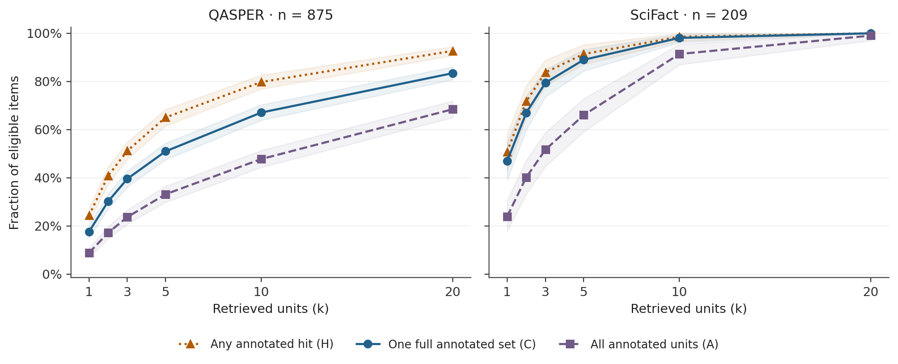

# When Evidence Sets Become Relevance Lists: A Controlled Audit of Scientific Retrieval Evaluation

Yunya Lin — University of Illinois Urbana-Champaign

## Abstract

Scientific evidence annotations often group jointly required units and alternative sets. We quantify the consequences of choosing completion of one observed set (C) or the annotated union (A), holding candidates and rankings fixed for 875 QASPER questions and 209 SciFact claim–abstract pairs. At prespecified BM25 budgets, C/A are 51.0/33.1% and 79.4/51.7%, respectively; paired gaps are 17.8 and 27.8 percentage points. Mean extra union-completion depth is 6.65 paragraphs and 2.02 sentences, with zero medians and no original primary F1 ranking reversal. Revision-added exploratory analysis shows that 75% completion needs uniform BM25 budgets of 14 versus 27 paragraphs and 3 versus 6 sentences. A real converter/scorer replay aligns 866 QASPER questions under an explicit candidate restriction: the flat export cannot generally recover C, while its conventional relevance metrics remain appropriate to their stated objective. Complete Qwen3-Embedding-0.6B rankings yield gaps of 23.1 and 27.3 points. Among 195 exact-answer-agreement questions, pruning yields an 8.2-point gap, characterizing a restricted cohort and target rather than a bound or causal decomposition. The contribution is an empirical audit of annotation-defined measurement and budget sensitivity, not a new completion criterion or evidence of semantic sufficiency.

## Introduction

A scientific question-answering workflow may export annotated evidence into ordinary query–passage relevance judgments before comparing retrievers. That export can preserve every marked passage while losing which passages were selected together and which selections were alternatives. The practical question is whether the resulting score still measures the outcome that the workflow intends to report.

Suppose one annotation contains paragraphs a and b together, while another contains paragraph c alone. Retrieving a finds evidence but completes neither annotation; retrieving c completes an annotation without covering all marked paragraphs. These outcomes matter when a report moves from “relevant evidence was retrieved” to “the annotated support was recovered.” The distinction depends on the target, not on whether a metric is conventionally named recall.

We hold candidates, eligibility, and rankings fixed and compare any annotated hit (H), completion of one original set (C), and completion of the annotated union (A). The frozen analysis covers 875 QASPER questions and 209 SciFact claim–abstract pairs with three retrievers and two controls. Revision-added exploratory analyses trace a real conversion and scorer, invert completion curves into uniform budgets, and add Qwen3-Embedding-0.6B on the same cohorts.

At the prespecified BM25 budgets, the C−A gaps are 17.8 points for QASPER and 27.8 for SciFact. Both extra-depth medians are zero, and original primary F1 ordering is stable. These adverse findings limit the interpretation of positive average costs.

The contribution is an empirical measurement audit: paired completion and prefix-cost differences, their distribution and topology, and the budget consequences of choosing an annotation target. Complete-set retrieval, depth to sufficient evidence, and group-versus-union comparison have precedents (Alt et al., 2026; Li et al., 2025). The executed conversion-and-scoring path connects this distinction to an actual flat export, without treating flat qrels as union completion or indicting the official evaluators, which preserve alternatives for their stated objectives.

## Related work and evaluation targets

### Test collections, pooling, and incomplete judgments

The Cranfield paradigm uses documents, information needs, and relevance judgments to compare retrieval systems under controlled conditions. Its value is comparative experimental control, not a claim that one label represents every aspect of user relevance (Voorhees, 2002; Saracevic, 2007). Flat binary or graded qrels support their intended Recall, AP, nDCG, and MRR calculations. Their suitability depends on the task definition and the available judgments. Our result does not make those measures invalid for ordinary document retrieval.

Pooling addresses the cost of finding documents to judge. Zobel’s investigation of large TREC experiments found reasonably reliable relative system comparisons alongside incomplete discovery of relevant documents (Zobel, 1998). Buckley and Voorhees explicitly tested substantial judgment incompleteness and developed bpref, which compares judged relevant and judged nonrelevant documents rather than treating every unjudged document as a known negative (Buckley and Voorhees, 2004). D-MERIT revisits the consequences of partial annotation for retrieval assessment (Rassin et al., 2024).

Those problems concern missing or uncertain unit-level judgments. Our controlled intervention retains every observed annotated unit and removes only the original grouping when forming the union target. It therefore neither corrects incomplete qrels nor assumes that the observed union contains all semantically relevant evidence. Missing relevant units and discarded relationships can coexist, but they are different changes to the evaluation input.

### Dependent relevance, diversity, and information coverage

Beyond Independent Relevance already makes the usefulness of a result depend on other retrieved results. Its subtopic-retrieval formulation uses document-to-subtopic judgments and evaluates coverage of distinct subtopics (Zhai et al., 2003). This directly overlaps with our concern that unit membership alone may be inadequate. The distinction is narrower: subtopic coverage does not, without an additional interpretation, specify that a particular pair of evidence units is jointly required while another unit is an accepted alternative.

Clarke et al. model information nuggets and reduce the marginal gain from repeatedly covered nuggets in alpha-nDCG; this supports novelty and diversity under a ranked-list objective (Clarke et al., 2008). Agrawal et al. define intent-aware measures by evaluating rankings with respect to individual intents and weighting by the intent distribution (Agrawal et al., 2009). These are richer representations than one relevance bit. They could be extended or configured to express evidence requirements, but their usual labels and objectives do not automatically encode the accepted combinations measured by C. Conversely, our exact binary completion endpoint lacks their graded utility, rank discounting, and intent weighting.

Information-unit coverage is also central to TREC question answering. Definition-answer evaluation distinguishes vital and other nuggets, and nugget pyramids aggregate assessor judgments about nugget importance (Voorhees, 2004; Lin and Demner-Fushman, 2006). The TREC 2025 RAG overview describes sub-narrative relevance, nugget-based response completeness, and attribution evaluation (Upadhyay et al., 2026). These precedents prevent treating “coverage beyond a document hit” as a new contribution. Recovering source evidence sets is related to, but not identical with, covering semantic nuggets or verifying generated claims.

### Structured evidence and modern retrieval evaluation

QASPER associates answer annotations with evidence and uses best-reference Evidence F1. SciFact represents sentence rationales and accepts a complete rationale for its abstract-level evidence condition; sentence-level coverage is a different objective. FEVER and FEVEROUS likewise use composite evidence annotations (Dasigi et al., 2021; Wadden et al., 2020; Thorne et al., 2018; Aly et al., 2021). These benchmarks already supply relationships whose retention enables multiple legitimate scoring choices. QASPER answer-writer evidence is not independently certified as a smallest sufficient justification; SciFact rationales are more directly tied to supporting or refuting a claim.

Other modern evaluations ask questions outside exact annotation completion. eRAG studies generator-conditioned retrieval utility; Sufficient Context distinguishes the availability of sufficient context from a model’s ability to use it (Salemi and Zamani, 2024; Joren et al., 2025). Attribute or Abstain studies attribution and abstention, while Document Structure in Long Document Transformers examines structural modeling (Buchmann et al., 2024a; Buchmann et al., 2024b). Ev2R combines reference alignment and verdict-oriented evidence assessment (Akhtar et al., 2026). None licenses interpreting C as semantic sufficiency or as measured downstream answer quality.

### Closest work: sufficient-set ranking and evidence groups

Alt et al. define sufficient ranked prefixes and Minimal Sufficient Rank (MSR), then compare evidence-ranking methods and user reading effort (Alt et al., 2026). Under their gold-set completion criterion, MSR equals our dC. Their normalized reciprocal rank is based on MSR minus ideal MSR plus one; we do not introduce that stopping-depth concept. Our intervention instead holds every ranking fixed and contrasts one-reference with union completion.

Li et al. identify minimal evidence groups, score exact and best soft group matches, and compare group and union inputs for claim reconstruction under word and sentence budgets (Li et al., 2025). Thus group-versus-union and budget comparisons are established. Our narrower addition is the paired C−A and dA−dC distribution in two scientific cohorts, its annotation-topology decomposition, and uniform completion thresholds. We measure annotated prefixes rather than user effort or generation savings.

Recent work further narrows the novelty boundary. RARE tracks interchangeable information across passages and evaluates redundancy-aware coverage and complete recall (Cho and Lee, 2026). The Missing Complement uses grouped requirements and alternative complete branches for state-conditioned coding-agent retrieval; RINSE scores evidence sufficiency before generation using paired support contrasts (Feng et al., 2026; Chen et al., 2026). These two September 2026 works are preprints. Together with conjunctive and budget-constrained retrieval studies (Cha et al., 2026; Nguy, 2026), they establish a broad set-oriented literature; our claim is this controlled representation audit, not the invention of set coverage.

*Representations and the targets they directly support. The distinction is informational, not a claim of metric invalidity or formal novelty.*

| Representation | Documented target | What is still needed for C? |
| --- | --- | --- |
| Flat binary/graded qrels | Recall, AP, nDCG, MRR under their relevance and judgment conventions; H/A from binary union membership. | Accepted combinations cannot generally be recovered from membership alone. |
| Intent or subtopic labels | Intent-weighted utility and coverage of distinct subtopics. | A rule linking labels/units to accepted evidence combinations. |
| Nugget labels and weights | Coverage/importance of information units and redundancy-sensitive gain. | A mapping from semantic coverage to accepted source-evidence combinations. |
| Structured evidence families | H, C, A, and best-reference/union variants, once the target is chosen. | Source validity and semantic sufficiency still require separate evidence. |

## Research questions and formalization

We ask how H, C, and A differ at fixed budgets, what additional prefix cost the union requires, and whether max-reference versus union F1 changes method comparisons. The last question is secondary; demonstrating a ranking reversal is not a success criterion.

Let E_1,...,E_m be nonempty subsets of a document's retrieval units, U their union, and R the retrieved prefix. Define:

$$
H(R)=\mathbf{1}[R\cap U\ne\varnothing],\quad C(R)=\mathbf{1}[\exists j:E_j\subseteq R],\quad A(R)=\mathbf{1}[U\subseteq R].
$$

For every item, A is no larger than C, and C is no larger than H. We call H-C the fragment gap and C-A the union gap. Their nonnegativity is guaranteed by the definitions; we estimate their magnitude and do not test the inequalities as empirical hypotheses. The gaps do not count incorrect answers. H and A are boundary conditions on ordinary union recall: H indicates nonzero recall, and A indicates recall equal to one.

For the family E1={a,b}, E2={c}, the following prefixes separate the three targets. The unannotated unit d is included to make a zero-hit case explicit. These are illustrative calculations, not new empirical observations.

*Illustrative family E1={a,b}, E2={c}. Brackets denote retrieved order; d is unannotated.*

| Retrieved prefix | H | C | A |
| --- | --- | --- | --- |
| [] | 0 | 0 | 0 |
| [a] | 1 | 0 | 0 |
| [a,b] | 1 | 1 | 0 |
| [c] | 1 | 1 | 0 |
| [a,c] | 1 | 1 | 0 |
| [a,b,c] | 1 | 1 | 1 |
| [d] | 0 | 0 | 0 |

### Why flat membership is insufficient

Consider two annotation families, {{a},{b}} and {{a,b}}, with the same union {a,b}. For retrieved set {a}, every metric that sees only retrieved units and flat binary membership receives identical information. Yet C is one for the first family and zero for the second. Thus no function of R and U alone can recover annotation completion for all possible annotation families. This elementary counterexample identifies the lost information; it is not claimed as a new theory of relevance. Flattening does not itself require an evaluator to use A; it removes the grouping information needed to recover C from flat membership alone.

Duplicates do not change H, C, or A. Pruning strict supersets preserves C and dC, shrinks or preserves U, can only increase A and decrease H, and cannot increase C−A. These properties do not extend to best-reference F1: with references {a} and {a,b} and prefix {a,b}, pruning the latter changes best-reference F1 from 1 to 2/3. “Minimal” means inclusion-minimal within the observed family, not semantically necessary.

### Ranked completion and budget

Let rank(e) be a unit's one-based position in a complete ranking. The first depth completing one reference and the depth completing the union are:

$$
d_C=\min_j\max_{e\in E_j}\operatorname{rank}(e),\qquad d_A=\max_{e\in U}\operatorname{rank}(e),\qquad \Delta d=d_A-d_C.
$$

Under the gold-set criterion, dC is MSR (Alt et al., 2026). We contrast dA−dC and cumulative lexical-token costs at these depths. These oracle stopping depths require the annotations and are not measured reading time or inference charges.

For a target proportion tau, a uniform population budget is the smallest integer k at which the item-weighted completion rate reaches tau:

$$
B_X(\tau)=\min\{k:N^{-1}\sum_i X_i(k)\geq\tau\},\quad X\in\{C,A\},\quad\tau\in\{0.50,0.75,0.90\}.
$$

This is a quantile of completion depths, not the mean of individual dA−dC. We evaluate all available integer depths, retaining saturated documents in the denominator. Token thresholds use cumulative lexical tokens under the same complete-prefix rule. Paired cluster resampling carries both targets through each inverse; unreachable values remain explicit rather than discarded or extrapolated.

We also report union recall and max-reference recall, and two F1 definitions:

$$
F_{1,\max}(R)=\max_j\frac{2|R\cap E_j|}{|R|+|E_j|},\qquad F_{1,U}(R)=\frac{2|R\cap U|}{|R|+|U|}.
$$

Unlike the binary completion endpoints, the two F1 scores have no universal order. A union can increase both the number of matched units and the reference denominator. Exact best-reference F1 is appropriate to compare with the QASPER implementation; these retrieval-only scores are not the full official task scores.

## Data and experimental design

### QASPER cohort

We use QASPER v0.3 test, containing 1451 questions in 416 papers. Candidate units are nonempty full-text paragraphs; whitespace-normalized duplicate paragraphs collapse to one content unit. A question is retained only when every answer annotation is answerable and has nonempty, wholly mappable textual evidence. Any figure/table marker, missing evidence, or unmapped textual evidence excludes the whole question. We do not remove an inconvenient piece of a reference while retaining the rest.

This yields 875 questions from 367 papers. The strict cohort excludes 576 questions. Overlapping exclusion reasons comprise 253 with figure/table evidence, 288 with empty evidence, 243 with an unanswerable annotation, and 89 with unmapped text. These counts overlap; the accompanying eligibility CSV records an alphabetical first-reason hierarchy separately. Results cannot be generalized without qualification to all QASPER questions, especially multimodal and disputed-answer items.

### SciFact cohort

We use the official SciFact development release downloaded on 3 October 2026 UTC. Its 300 claims include 188 with evidence and 112 without evidence. The evidence-bearing claims produce 209 eligible claim-abstract pairs. Candidate units are all sentences within the known gold abstract. Every rationale must be nonempty, in range, and consistently labelled with the other rationales for that pair.

The abstract is supplied, so this experiment evaluates rationale retrieval rather than discovering relevant abstracts or predicting scientific verdicts. We preserve sentence identifiers and do not collapse distinct positions. Claim-abstract pairs sharing either a claim or an abstract form connected components for statistical resampling, yielding 164 groups. No-evidence claims are not eligible pairs, and their counts must not be subtracted directly from the pair denominator.

The acquired SciFact release contains up to 6 rationales per pair, beyond the original paper’s description of up to three. We analyze those acquired annotations; the supplement identifies the pinned archive.

*Source and analysis denominators. QASPER exclusion reasons overlap; SciFact claims and claim-abstract pairs are different units.*

| Quantity | QASPER test | SciFact dev |
| --- | --- | --- |
| Source questions / claims | 1451 | 300 |
| Source papers | 416 | Known abstract supplied |
| Eligible questions / pairs | 875 | 209 |
| Resampling clusters | 367 | 164 |
| Multiple distinct evidence sets | 472 | 85 |
| Multiple minimal evidence sets | 285 | 85 |
| No singleton reference | 127 | 14 |
| Exact answer agreement | 195 | Consistent rationale labels |

### Pilot and frozen design

A disjoint pilot contained 88 QASPER development questions and 47 SciFact training items. The primary design was then frozen locally, not publicly preregistered. No retriever was tuned on either main cohort. The original experiment contains 5420 full rankings and 32520 unit-budget points. Earlier post-main sensitivities and the present revision-added analyses are stored separately; their plans acknowledge the already observed primary results.

### Retrieval methods

BM25 uses k1=1.2 and b=0.75, with within-document inverse document frequencies and positive IDF log(1+(N-df+0.5)/(df+0.5)). Query terms are deduplicated and sorted before summation. The implementation follows the probabilistic relevance model family (Robertson and Zaragoza, 2009), with this variant stated explicitly. TF-IDF uses word unigrams, smoothed IDF, L2 normalization, and cosine similarity. Both lexical methods tokenize lowercase Unicode word sequences without stop-word removal.

The original neural retriever is sentence-transformers/all-MiniLM-L6-v2, pinned to official weights, using ONNX inference, attention-mask mean pooling, L2 normalization, cosine similarity, and a 256-wordpiece limit including special tokens. CPU batches contain 16 inputs with two intra-operation threads. It is a robustness instrument, not an uncontaminated scientific-retrieval benchmark.

The revision adds Qwen3-Embedding-0.6B (Qwen Team, 2025). Its fixed revision is 97b0c614be4d, selected before its effectiveness was observed. It uses float32 CPU inference, last nonpadding token pooling with attention masks, left padding, L2 normalization, 1,024 dimensions, and an 8,192-model-token limit. Queries receive one fixed scientific-evidence instruction; documents do not. Original candidates, index-based tie breaking, budgets, and cluster labels are retained.

Lead-position and deterministic random rankings provide controls. Random scores use a per-item seed derived from the fixed seed, corpus, and item ID, giving one reproducible permutation per item. Ties in all methods resolve by original unit order. Full rankings are saved. The same ranking is reused for every scoring rule, preventing retrieval variation from confounding the comparison.

### Budgets, estimands, and uncertainty

Primary comparisons are BM25 at five paragraphs for QASPER and three sentences for SciFact. Curves report k=1, 2, 3, 5, 10, 20. Prefixes saturate at document length; the denominator remains all eligible items. Supplementary lexical-token budgets are 64, 128, 256, 512, 1024, 2048. A token-bounded prefix stops before the first complete unit that would exceed its budget; it does not skip or truncate that unit. Lexical tokens differ from the encoder's wordpieces, and equal token budgets across corpora do not imply equal tasks.

For each corpus separately, we estimate item-weighted means and 95% percentile cluster-bootstrap intervals using 10,000 replicates and seed 20261002. Each replicate samples observed clusters with replacement and divides summed item outcomes by the resulting number of sampled items. The same cluster weights are used for paired scores and method contrasts. Unequal cluster sizes are therefore retained rather than averaging cluster means with equal weight.

These cohorts are censuses of eligible benchmark items, not probability samples of scientific information needs. Intervals describe stability under observed-cluster resampling, excluding annotation and selection uncertainty. Exploratory contrasts use pointwise intervals without multiplicity-adjusted significance claims.

### Robustness and implementation validation

Prespecified sensitivities cover answer agreement, superset pruning, 100 deterministic single-reference selections, neural versus lexical rankings, token versus unit budgets, and corpus-specific dependence. Single-reference selection deliberately changes the accepted family; it is not improved gold.

The joint answer-agreement/pruning sensitivity, topology decomposition, implementation sample, and original result-blind Qwen timing gate were post-main additions reported in v1.0.0. The present revision adds the paired subgroup/pruning table, uniform-budget analysis, executed conversion/scoring path, a deterministic agreement example, and complete Qwen rankings. All are exploratory and were planned with the earlier results known. Original cohorts, primary rankings, budgets, and frozen outputs remain unchanged.

## Results

### Cohort structure

The observed annotation families differ substantially. QASPER has 472 items with multiple distinct sets, but only 285 with multiple minimal sets: nested annotations account for part of its multiplicity. SciFact has 85 items with multiple distinct sets, and none of its distinct rationales overlap within an item. Thus the two corpora provide different structural settings rather than interchangeable replications.

Only 127 QASPER questions and 14 SciFact pairs lack a singleton reference. A small fragment gap is consequently unsurprising in SciFact: whenever a retrieved annotated singleton is itself a full rationale, H and C coincide. The more consequential issue there is treating several acceptable rationales as one mandatory union. This topology is a mechanism for the result, not a confound to be statistically removed.

### Fixed-budget completion gaps

At the primary QASPER budget, BM25 attains H=65.0%, C=51.0%, and A=33.1%. The fragment gap is 14.1 percentage points (95% cluster interval 11.7 to 16.4); the union gap is 17.8 points (15.3 to 20.4). At the primary SciFact budget, H=83.7%, C=79.4%, and A=51.7%. Its fragment gap is 4.3 points (1.8 to 7.2), and its union gap is 27.8 points (21.2 to 34.3). These are paired differences for exactly the same retrieved prefixes.

*Fixed-budget outcomes on the full eligible cohorts. H: any annotated hit; C: one completed set; A: completed union. C−A uses paired 95% cluster intervals. Lead and random are controls. Qwen3 is revision-added exploratory; other rows are the frozen original analysis.*

| Corpus / k | Method | H (%) | C (%) | A (%) | C−A, pp [95% interval] |
| --- | --- | --- | --- | --- | --- |
| QASPER / 5 | BM25 | 65.0 | 51.0 | 33.1 | 17.8 [15.3, 20.4] |
| QASPER / 5 | TF-IDF | 62.7 | 48.7 | 31.2 | 17.5 [15.0, 20.0] |
| QASPER / 5 | MiniLM | 68.9 | 54.9 | 33.4 | 21.5 [18.6, 24.3] |
| QASPER / 5 | Lead | 23.4 | 17.9 | 7.3 | 10.6 [8.4, 12.9] |
| QASPER / 5 | Random | 26.6 | 16.1 | 6.6 | 9.5 [7.5, 11.5] |
| QASPER / 5 | Qwen3 | 78.2 | 65.0 | 41.9 | 23.1 [20.2, 26.0] |
| SciFact / 3 | BM25 | 83.7 | 79.4 | 51.7 | 27.8 [21.2, 34.3] |
| SciFact / 3 | TF-IDF | 79.9 | 76.1 | 48.8 | 27.3 [20.6, 34.1] |
| SciFact / 3 | MiniLM | 82.3 | 78.5 | 50.7 | 27.8 [21.1, 34.6] |
| SciFact / 3 | Lead | 26.3 | 22.0 | 13.9 | 8.1 [4.3, 12.6] |
| SciFact / 3 | Random | 61.7 | 54.5 | 31.6 | 23.0 [16.9, 29.0] |
| SciFact / 3 | Qwen3 | 90.4 | 86.6 | 59.3 | 27.3 [20.9, 33.9] |

Figure 1 shows that the distinctions persist across budgets and eventually narrow as prefixes approach complete documents. SciFact reaches high completion at shorter unit budgets because it searches within short abstracts. Its apparent advantage must not be interpreted as a corpus-level comparison of retrieval difficulty: the tasks, candidate sets, and unit sizes differ. Long-list saturation is included rather than dropping short documents at large k.

BM25 completion curves. Shaded bands are 95% cluster-bootstrap intervals. The same prefixes are scored under all three definitions. Units are paragraphs for QASPER and sentences for SciFact; large k saturates at document length.

The union gap also appears under TF-IDF and MiniLM. For QASPER, MiniLM yields C=54.9% and A=33.4%; for SciFact, the rates are 78.5% and 50.7%. The result therefore does not depend on one lexical scoring formula. Controls have lower completion but can still exhibit aggregation gaps, because the relationships follow the annotations and retrieved prefixes rather than a model class.

### Additional ranked budget

For BM25, reaching the union instead of one original set requires an average of 6.65 extra QASPER paragraphs (95% interval 5.69 to 7.70) and 2.02 extra SciFact sentences (1.48 to 2.63). The corresponding average additional lexical tokens are 540.9 and 58.5. These means pool all eligible items within each corpus, including items whose penalty is zero.

Both BM25 depth medians are zero; 54.9% of QASPER items and 59.3% of SciFact items have no penalty. Positive means therefore summarize a heterogeneous tail. The supplement reports the distribution among all items and among affected items, while the next analysis asks a different population-budget question.

*Extra fixed-ranking prefix budget required for the union instead of one original reference. Means have 95% cluster intervals; depth medians have interquartile ranges. Lexical tokens are not encoder wordpieces. Qwen3 is revision-added exploratory.*

| Corpus | Method | Extra units: mean [CI] | Median [IQR] | Extra tokens: mean [CI] |
| --- | --- | --- | --- | --- |
| QASPER | BM25 | 6.65 [5.69, 7.70] | 0 [0, 7] | 540.9 [463.7, 624.0] |
| QASPER | TFIDF | 6.61 [5.67, 7.63] | 0 [0, 8] | 540.9 [463.7, 623.8] |
| QASPER | MiniLM | 6.22 [5.41, 7.09] | 0 [0, 8] | 509.3 [440.3, 581.4] |
| QASPER | Qwen3 | 5.89 [5.15, 6.67] | 0 [0, 8] | 474.2 [414.2, 537.9] |
| SciFact | BM25 | 2.02 [1.48, 2.63] | 0 [0, 3] | 58.5 [43.0, 76.3] |
| SciFact | TFIDF | 2.04 [1.51, 2.63] | 0 [0, 3] | 59.5 [43.9, 77.0] |
| SciFact | MiniLM | 1.87 [1.33, 2.53] | 0 [0, 3] | 54.6 [39.4, 72.7] |
| SciFact | Qwen3 | 1.61 [1.20, 2.05] | 0 [0, 2] | 47.6 [35.7, 60.7] |

### Revision-added uniform completion budgets

At 75% completion, BM25 requires 14 QASPER paragraphs under C and 27 under A: a uniform-budget difference of 13 [10, 15] paragraphs. SciFact requires 3 versus 6 sentences, a difference of 3 [2, 4]. The table retains all three prespecified thresholds; every point estimate and bootstrap threshold is attained.

*Revision-added exploratory BM25 minimum uniform budgets, with paired 95% cluster intervals. Units are paragraphs for QASPER and sentences for SciFact. All three thresholds use every eligible item; all bootstrap thresholds are attained. These are population thresholds, not mean individual extra costs.*

| Corpus / target | B_C [CI] | B_A [CI] | B_A−B_C [CI] |
| --- | --- | --- | --- |
| QASPER / 50% | 5 [5, 6] | 11 [10, 13] | 6 [5, 7] |
| QASPER / 75% | 14 [13, 16] | 27 [24, 29] | 13 [10, 15] |
| QASPER / 90% | 30 [27, 33] | 44 [40, 49] | 14 [10, 18] |
| SciFact / 50% | 2 [1, 2] | 3 [3, 4] | 1 [1, 3] |
| SciFact / 75% | 3 [3, 4] | 6 [6, 7] | 3 [2, 4] |
| SciFact / 90% | 6 [4, 7] | 9 [8, 12] | 3 [2, 6] |

These exact minima invert the full empirical completion curves: every possible integer prefix depth is represented by its completion events. They describe one common budget for the population, whereas mean extra depth averages different item-specific stopping points. Short documents stay in the denominator after saturation. The supplementary lexical-token thresholds retain the same complete-prefix rule; neither statistic measures human reading time or deployed inference cost.

### Exploratory topology decomposition

An exploratory post-main decomposition partitions each cohort into four disjoint categories after deduplicating identical sets: one distinct set; several sets with one minimal set; several minimal sets without supersets; and several minimal sets with supersets. “Minimal” means no strict subset occurs in the observed family. It does not certify semantic necessity. The category counts are 403, 187, 243, and 42 for QASPER, and 124, 0, 85, and 0 for SciFact.

*Exploratory post-main, mutually exclusive topology strata at BM25 primary budgets. n/g gives items/represented clusters. Gap and full-cohort contribution are percentage points with 95% cluster intervals; represented clusters can overlap across strata. Empty categories are shown explicitly.*

| Corpus and category | n/g | C−A, pp [CI] | Contribution, pp [CI] |
| --- | --- | --- | --- |
| QASPER: One distinct set | 403/246 | 0.0 [0.0, 0.0] | 0.00 [0.00, 0.00] |
| QASPER: Multiple sets, one minimal | 187/145 | 27.8 [21.6, 34.4] | 5.94 [4.42, 7.59] |
| QASPER: Multiple minimal, no supersets | 243/180 | 36.2 [30.6, 42.2] | 10.06 [8.13, 12.05] |
| QASPER: Multiple minimal plus supersets | 42/33 | 38.1 [22.0, 54.8] | 1.83 [0.89, 2.92] |
| SciFact: One distinct set | 124/102 | 0.0 [0.0, 0.0] | 0.00 [0.00, 0.00] |
| SciFact: Multiple sets, one minimal | 0/0 | — | 0 (empty) |
| SciFact: Multiple minimal, no supersets | 85/70 | 68.2 [57.8, 77.9] | 27.75 [21.20, 34.30] |
| SciFact: Multiple minimal plus supersets | 0/0 | — | 0 (empty) |

One distinct set forces C−A=0. QASPER’s four contributions are 0.00, 5.94, 10.06, and 1.83 percentage points, each obtained by multiplying its stratum mean by its cohort fraction. They reconstruct the 17.83-point overall gap before rounding. The two multiple-minimal-set categories account for most of that gap, while nested families with one minimal set contribute another 5.94 points. SciFact’s entire 27.75-point gap comes from its 85 pairs with multiple minimal sets. This identifies where flattening matters in the observed annotations; it does not estimate the causal effect of collecting another annotation.

Stratum intervals resample represented clusters; contribution intervals resample the full cohort with out-of-stratum outcomes set to zero. Full depth/token contributions and singleton/agreement modifiers remain in the supplement, including empty and sparse cells. No predictive model is fitted.

### F1 and comparisons among retrieval methods

Large completion differences need not produce large average F1 differences. QASPER BM25 max-reference F1 is 0.227, while union F1 is 0.228; SciFact values are 0.421 and 0.434. The larger union F1 in these BM25 settings illustrates why it cannot be assumed to fall below best-reference F1. The binary endpoints and continuous overlap scores answer different questions.

The ordering of BM25, TF-IDF, and MiniLM does not reverse between max-reference and union F1 at the primary budgets. The original methods therefore do not demonstrate a ranking reversal. Aggregation does change the magnitude of some contrasts: MiniLM's QASPER completion advantage over BM25 is 3.9 points under C and 0.2 under A. These comparisons are exploratory, and their pointwise intervals are retained in the results package rather than used to declare an unadjusted significance finding.

### Revision-added complete Qwen comparison

Complete Qwen3 rankings yield QASPER H/C/A=78.2/65.0/41.9%, C−A=23.1 [20.2, 26.0] points, and mean extra depth 5.89 (median 0); SciFact H/C/A=90.4/86.6/59.3%, C−A=27.3 [20.9, 33.9] points, and mean extra depth 1.61 (median 0). The revision contains 6,504 full rankings and 39,024 points across the six original unit budgets when the historical and new methods are counted together; the original block remains unchanged.

QASPER Qwen3−BM25 differences are 14.1 points under C and 8.8 under A; SciFact Qwen3−BM25 differences are 7.2 points under C and 7.7 under A. The fixed revision-added exploratory comparisons show no new primary F1 ranking reversal. The supplement reports every primary paired comparison against BM25 and MiniLM; all six budgets and all fixed metrics remain in the machine-readable results. These are exploratory pointwise comparisons.

## Robustness and error analysis

### Answer agreement, nesting, and annotation count

Answer agreement uses the original exact normalized-string rule: ordered extractive spans, otherwise free-form answer, otherwise yes/no; lowercase, ASCII punctuation and English articles are removed, then whitespace is collapsed. It is neither semantic agreement nor evidence that its complement is semantically conflicting. The supplement gives the exact implementation.

The paired subgroup table separates two operations. Selecting 195 agreement questions changes cohort composition; pruning strict supersets changes the target on the same questions and rankings. The original gap is 12.3 points in that subset and 11.8 after pruning the full cohort. Subgroup-weighted means reconstruct the full-cohort values. Shared papers can occur in both subgroups; paper counts must not be added.

Among the 195 questions in 149 papers satisfying exact normalized answer agreement, pruning yields an 8.2-point gap (95% interval 4.5–12.4). This characterizes a restricted cohort and annotation target. It establishes no formal bound on the full-cohort gap and does not isolate the causal effect of answer disagreement. Paired pruning differences in the table describe within-item transformations only. SciFact has no strict supersets to remove.

*Revision-added exploratory QASPER BM25 at k=5. n/p gives questions/papers; papers overlap across subsets. Gap values are percentage points with paired paper-cluster 95% intervals. The last column is a within-item target transformation, not a causal comparison between cohorts.*

| Cohort | n/p | Original C−A | Pruned C−A | Pruned − original |
| --- | --- | --- | --- | --- |
| Exact agreement | 195/149 | 12.3 [7.8, 17.1] | 8.2 [4.5, 12.4] | -4.1 [-7.1, -1.5] |
| Complement | 680/337 | 19.4 [16.5, 22.5] | 12.8 [10.4, 15.3] | -6.6 [-8.7, -4.7] |
| Full cohort | 875/367 | 17.8 [15.3, 20.4] | 11.8 [9.7, 13.9] | -6.1 [-7.7, -4.5] |

Selecting one reference per item forces C and A to coincide, as expected, but also discards valid observed alternatives. Across 100 deterministic selections, BM25 one-reference completion averages 42.0% for QASPER and 64.9% for SciFact, compared with 51.0% and 79.4% when any original reference may be completed. The range across selections is a diagnostic of reference choice, not a confidence interval. Choosing one reference is therefore not a neutral repair for flattening.

### Exploratory presentation of preselected cases

The new QASPER panel was selected by SHA-256 order among 16 eligible questions with exact answer agreement, multiple minimal references, no supersets, and BM25 C=1/A=0 at k=5. Selection used already known outcomes. The original nesting/disagreement QASPER panel and a SciFact control remain in the supplement. All are annotation illustrations, without new human semantic validation.

*Exploratory annotation case: QASPER. Unit indices are zero-based in the released mapping; source-unit IDs use paper:paragraph:index or abstract:sentence:index. Brief excerpts are from the identified source. No new human semantic validation is claimed.*

| Field | Recorded example |
| --- | --- |
| Source IDs | 1804.07445; item 0bde3ecfdd7c4a9af23f53da2cda6cd7a8398220 |
| Question / claim | what language was the data in? |
| Answer / label | English; English ; English |
| Evidence family | E1={24}; E2={20}; E3={24} |
| Exact prefix | [27,29,20,26,0] at k=5 |
| Completion | H=1, C=1, A=0; dC=3, dA=16 |
| Brief unit excerpts | 20: “aligned complex-simple sentence pairs from English Wikipedia”; 24: “the output is grammatical English” |
| Interpretation | All three recorded answers normalize to English; duplicate {24} leaves two distinct singleton alternatives, {20} and {24}, with no nesting. Paragraph 20 describes English Wikipedia pairs, whereas paragraph 24 mentions grammatical English as a fluency criterion. The selected first case is retained despite this difference in how directly the paragraphs support the question. It demonstrates annotation-defined same-answer alternatives; no independent human judgment establishes semantic sufficiency of either singleton. |

Numerical checks reproduce frozen scoring and cluster intervals and validate the new pruning, budget, encoder, and real-scorer calculations. The supplement and release QA record their scope; these are automated checks, not independent replication or human peer review.

## Exploratory implementation audit

### Bounded sample and representation classes

The previous post-main audit used a written protocol, disclosed prior official-evaluator familiarity, and searched GitHub and Hugging Face with benchmark names combined with neutral loader, evaluation, conversion and RAG phrases. Fifteen downstream implementation families per benchmark were inspected after lineage deduplication and deterministic selection. Official implementations are separate reference cases. The supplement preserves the five-way counts, exclusions, search coverage, uncertainty and selection corrections.

Representations were classified as preserved, flat only, both exposed, other/not applicable, or undetermined using pinned tracing and six fixtures. Nested lists can preserve alternatives without set IDs. The present revision executes one converter/scorer path; neither the historical sample nor a second automated consistency pass constitutes independent human annotation.

### What the inspected representations show

Two sampled QASPER families expose flat-only representations: sscc-rag-paper paragraph qrels and mteb/QASPER. Flat membership does not reconstruct C in general, but a released target need not equal the original union. We therefore verify exact mapped membership in the executed case and show nonmatching transformations separately.

CGSN, DEFT, and the VikingRAG/OpenViking lineage expose grouped and aggregated QASPER paths. The sampled BigBio SciFact distribution preserves rationale groups; another family retains structured claims beside a flattened-sentence helper. Thirteen SciFact families use document-level qrels, query-only distributions, or changed tasks and are not sentence-rationale flattening cases. One QASPER context-list distribution remains undetermined because its conversion is unavailable.

Official evaluators preserve alternatives for their objectives. The bounded sample does not estimate prevalence or demonstrate widespread metric defects. The executed path supplies a concrete representation boundary; the controlled results quantify sensitivity to a subsequently chosen completion target.

### Revision-added executed conversion and scoring

We selected the already-audited sscc-rag-paper converter and scorer under a written bounded rule. The pinned commit is da7e8fb13f29. Its unchanged native development loader exported 888 queries; a data-supply wrapper reproduced that output exactly, then supplied the frozen test data to the same conversion logic. The actual JSONL export/reload and ir_measures scorer were executed. Scoring maps the original normalized body-text units to canonical exported IDs and reuses the five frozen rankings, rather than reproducing the upstream pooled retrieval or generator.

*Revision-added real converter/scorer replay on 866 questions in 364 papers, with exact union membership under the stated text mapping and original candidate restriction. Actual Recall/nDCG are conventional relevance measures; C/A are separate completion targets at k=5. The paired gap uses paper-cluster 95% intervals. This is not native pooled-retrieval performance.*

| Method | Recall@5 (%) | nDCG@10 (%) | C (%) | A (%) | C−A, pp [CI] |
| --- | --- | --- | --- | --- | --- |
| BM25 | 46.4 | 42.3 | 51.4 | 33.5 | 17.9 [15.4, 20.5] |
| TF-IDF | 44.4 | 42.1 | 49.0 | 31.5 | 17.4 [14.9, 20.0] |
| MiniLM | 48.8 | 46.7 | 55.1 | 33.7 | 21.4 [18.6, 24.3] |
| Lead | 14.2 | 13.9 | 18.1 | 7.4 | 10.7 [8.5, 13.1] |
| Random | 14.0 | 15.5 | 16.3 | 6.7 | 9.6 [7.6, 11.7] |

All 875 eligible questions were exported. Under the explicit normalized-text mapping and candidate restriction, 866 questions in 364 papers have exact source-union/export-membership equality; 9 fail because strip-only matching loses evidence. At k=5 on the aligned subset, BM25 gives C=51.4%, A=33.5%, and a gap of 17.9 [15.4, 20.5] points. Actual Recall@5 is 46.4% and nDCG@10 is 42.3%; Recall@5 equals union overlap recall, and Success@5 equals H. Neither is union completion.

MiniLM’s completion advantage over BM25 is 3.70 points under C and 0.23 under A on this subset. The best-reference and union-F1 method orderings remain stable. The upstream scorer explicitly evaluates conventional relevance objectives; no mismatch between its stated objective and implementation is established. The case demonstrates lost information for recovering C and sensitivity of an added completion comparison, within a controlled candidate restriction. It does not show that ordinary relevance metrics should be replaced by A or C.

## Discussion

### What the audit establishes

The paired experiment isolates a change in annotation-completion target. Topology identifies where a difference is possible; ranking positions determine the finite-budget gap and tail cost. The new inverse-budget analysis translates those differences into uniform population budgets, and the converter replay verifies exact union membership after an explicit normalized-text and candidate-scope alignment; it does not identify the native exported task with the original retrieval universe.

The union target is harder by construction. Our measurements characterize that change; they do not reinterpret it as model failure. A deliberately exhaustive task may choose A, while one-rationale completion requires the original family. Best-reference scoring can favor the easiest annotation, and semantic evaluators may accept unannotated support. No one target is universally preferable.

### Implications for information representation and evaluation

An export intended to support C needs stable source-unit identity and evidence-family membership; nested lists suffice. Ordinary qrels remain appropriate for ordinary relevance metrics. Keeping grouped evidence alongside qrels lets users choose the documented target and reproduce both. Reports should state eligibility, duplicate handling, minimal-set structure, and the difference between uniform thresholds and individual oracle costs.

### Limits of transfer

The single modern encoder is a robustness check, not a model survey or deployment evaluation. Its full audit records 0 truncated queries, 0 items with truncated candidates, and 0 with truncated annotated evidence. Its tokenizer counts differ from the lexical cost measure. Qwen’s 8,192-token allowance and MiniLM’s 256-wordpiece allowance differ: with candidates and evaluation fixed, any performance advantage cannot be attributed to architecture alone. One seeded random ranking per item is a control, not an estimate over random retriever runs. Scientific pretraining overlap remains possible for both encoders.

## Limitations, ethics, and disclosure

The strongest limitation is the distance between annotated coverage and semantic sufficiency. Source annotations can be incomplete, nonminimal, or inconsistent; exact answer normalization is a conservative textual test rather than a semantic audit. Removing nested supersets changes the union target, and single-reference selection discards alternatives. We report those transformations as sensitivities, not newly validated gold labels.

The strict QASPER cohort represents only 60.3% of test questions. SciFact conditions on an evidence-bearing claim and known gold abstract. Both corpora involve scientific text in English, and neither samples all scientific information-seeking situations. Cluster intervals address observed dependence, not these selection mechanisms. The counterfactual score differences are exact for the saved rankings; their broader importance requires judgment about the intended task.

Only public benchmarks, implementations, and model weights were used. No participants were recruited, private records collected, or new human judgments created. No institutional ethics approval is claimed. The release documents third-party terms and acquisition rather than redistributing source-paper collections or model weights.

Generative AI tools (OpenAI Codex) supported grammar checking, language refinement, clarity, and organization. The author conceived the study, made the substantive methodological and interpretive decisions, conducted and verified the research, and wrote the substantive content. Under the author’s direction, tool assistance also supported code edits, reruns, numerical and reference checks, and preparation of figures and manuscript files. The author reviewed AI-assisted material and takes responsibility for the final work. AI is not an author.

## Conclusion

In fixed scientific rankings, completing one observed evidence set and exhausting the annotated union yield BM25 gaps of 17.8 points in QASPER and 27.8 in SciFact. The agreement-plus-pruning result of 8.2 points applies to a different cohort and target; it neither bounds the original result nor assigns a causal contribution to answer disagreement.

The executed converter/scorer path shows that a legitimate flat relevance export can lose information needed for an added completion target, without establishing a fault in its stated relevance evaluation. Uniform completion thresholds translate that distinction into explicit annotation-defined population budgets; the full-encoder check tests its persistence under one additional ranking model. The empirical distinction is unevenly distributed: one distinct set forces equality, both BM25 depth medians are zero, and the original primary F1 ordering is stable. These findings support retaining source groupings when annotation completion is the goal, while leaving ordinary relevance evaluation and semantic sufficiency as separate questions.

## Acknowledgments and disclosure of funding

No external funding or third-party computational resources were received or used for this work. All computational experiments were conducted locally on the author’s personal computer.

## Data and code availability

The repository is https://github.com/YoyoLin008/evidence-sets-retrieval-evaluation. This revision is frozen as v1.1.1 at https://github.com/YoyoLin008/evidence-sets-retrieval-evaluation/releases/tag/v1.1.1, within the verified Zenodo version family https://doi.org/10.5281/zenodo.23122619. The concept DOI identifies the version family; the exact tag identifies these files. The archive contains the tag source snapshot, all four final PDFs, frozen plans, acquisition hashes, code, saved rankings, mapping audits, and revision evidence. GitHub also supplies the submission ZIP. Original, earlier post-main, and revision-added outputs remain separate. Third-party source collections and model weights are acquired from their distributors and are not redistributed.

## References

Pradeep Dasigi, Kyle Lo, Iz Beltagy, Arman Cohan, Noah A. Smith, Matt Gardner. (2021). A Dataset of Information-Seeking Questions and Answers Anchored in Research Papers. Proceedings of the 2021 Conference of the North American Chapter of the Association for Computational Linguistics: Human Language Technologies, pp. 4599–4610. [10.18653/v1/2021.naacl-main.365](https://aclanthology.org/2021.naacl-main.365/)

David Wadden, Shanchuan Lin, Kyle Lo, Lucy Lu Wang, Madeleine van Zuylen, Arman Cohan, Hannaneh Hajishirzi. (2020). Fact or Fiction: Verifying Scientific Claims. Proceedings of the 2020 Conference on Empirical Methods in Natural Language Processing (EMNLP), pp. 7534–7550. [10.18653/v1/2020.emnlp-main.609](https://aclanthology.org/2020.emnlp-main.609/)

James Thorne, Andreas Vlachos, Christos Christodoulopoulos, Arpit Mittal. (2018). FEVER: a Large-scale Dataset for Fact Extraction and VERification. Proceedings of the 2018 Conference of the North American Chapter of the Association for Computational Linguistics: Human Language Technologies, Volume 1 (Long Papers), pp. 809–819. [10.18653/v1/N18-1074](https://aclanthology.org/N18-1074/)

Rami Aly, Zhijiang Guo, Michael Sejr Schlichtkrull, James Thorne, Andreas Vlachos, Christos Christodoulopoulos, Oana Cocarascu, Arpit Mittal. (2021). The Fact Extraction and VERification Over Unstructured and Structured information (FEVEROUS) Shared Task. Proceedings of the Fourth Workshop on Fact Extraction and VERification (FEVER), pp. 1–13. [10.18653/v1/2021.fever-1.1](https://aclanthology.org/2021.fever-1.1/)

Royi Rassin, Yaron Fairstein, Oren Kalinsky, Guy Kushilevitz, Nachshon Cohen, Alexander Libov, Yoav Goldberg. (2024). Evaluating D-MERIT of Partial-annotation on Information Retrieval. Proceedings of the 2024 Conference on Empirical Methods in Natural Language Processing, pp. 2913–2932. [10.18653/v1/2024.emnlp-main.171](https://aclanthology.org/2024.emnlp-main.171/)

Jan Buchmann, Xiao Liu, Iryna Gurevych. (2024a). Attribute or Abstain: Large Language Models as Long Document Assistants. Proceedings of the 2024 Conference on Empirical Methods in Natural Language Processing, pp. 8113–8140. [10.18653/v1/2024.emnlp-main.463](https://aclanthology.org/2024.emnlp-main.463/)

Jan Buchmann, Max Eichler, Jan-Micha Bodensohn, Ilia Kuznetsov, Iryna Gurevych. (2024b). Document Structure in Long Document Transformers. Proceedings of the 18th Conference of the European Chapter of the Association for Computational Linguistics (Volume 1: Long Papers), pp. 1056–1073. [10.18653/v1/2024.eacl-long.64](https://aclanthology.org/2024.eacl-long.64/)

Alireza Salemi, Hamed Zamani. (2024). Evaluating Retrieval Quality in Retrieval-Augmented Generation. Proceedings of the 47th International ACM SIGIR Conference on Research and Development in Information Retrieval, pp. 2395-2400. [10.1145/3626772.3657957](https://doi.org/10.1145/3626772.3657957)

Mubashara Akhtar, Michael Schlichtkrull, Andreas Vlachos. (2026). Ev2R: Evaluating Evidence Retrieval in Automated Fact-Checking. Transactions of the Association for Computational Linguistics, 14, pp. 530-561. [10.1162/tacl.a.647](https://aclanthology.org/2026.tacl-1.25/)

Hailey Joren, Jianyi Zhang, Chun-Sung Ferng, Da-Cheng Juan, Ankur Taly, Cyrus Rashtchian. (2025). Sufficient Context: A New Lens on Retrieval Augmented Generation Systems. International Conference on Learning Representations, pp. 20310–20334. [Source](https://proceedings.iclr.cc/paper_files/paper/2025/hash/33dffa2e3d2ab74a783d1a8c292f66d9-Abstract-Conference.html)

Sungguk Cha, DongWook Kim, Mintae Kim, Youngsub Han, Byoung-Ki Jeon, Sangyeob Lee. (2026). Do Current Retrievers Cover All the Evidence? A Controlled Study of Conjunctive Cross-Page Retrieval. arXiv preprint 2607.24165v2. [10.48550/arXiv.2607.24165](https://arxiv.org/abs/2607.24165v2)

Thomson D. Nguy. (2026). More Context, Same Budget: Dual-Bounded Relational Recall Beyond Top-K Retrieval. arXiv preprint 2608.18448v1. [10.48550/arXiv.2608.18448](https://arxiv.org/abs/2608.18448v1)

Stephen Robertson, Hugo Zaragoza. (2009). The Probabilistic Relevance Framework: BM25 and Beyond. Foundations and Trends in Information Retrieval, 3(4), pp. 333–389. [10.1561/1500000019](https://doi.org/10.1561/1500000019)

Tefko Saracevic. (2007). Relevance: A review of the literature and a framework for thinking on the notion in information science. Part II: nature and manifestations of relevance. Journal of the American Society for Information Science and Technology, 58(13), pp. 1915–1933. [10.1002/asi.20682](https://doi.org/10.1002/asi.20682)

Ellen M. Voorhees. (2002). The Philosophy of Information Retrieval Evaluation. Evaluation of Cross-Language Information Retrieval Systems. Lecture Notes in Computer Science, volume 2406, pp. 355-370. [10.1007/3-540-45691-0_34](https://doi.org/10.1007/3-540-45691-0_34)

Justin Zobel. (1998). How Reliable are the Results of Large-Scale Information Retrieval Experiments? Proceedings of the 21st Annual International ACM SIGIR Conference on Research and Development in Information Retrieval, pp. 307-314. [10.1145/290941.291014](https://doi.org/10.1145/290941.291014)

Chris Buckley, Ellen M. Voorhees. (2004). Retrieval Evaluation with Incomplete Information. Proceedings of the 27th Annual International ACM SIGIR Conference on Research and Development in Information Retrieval, pp. 25-32. [10.1145/1008992.1009000](https://tsapps.nist.gov/publication/get_pdf.cfm?pub_id=150469)

Cheng Xiang Zhai, William W. Cohen, John Lafferty. (2003). Beyond Independent Relevance: Methods and Evaluation Metrics for Subtopic Retrieval. Proceedings of the 26th Annual International ACM SIGIR Conference on Research and Development in Information Retrieval, pp. 10-17. [10.1145/860435.860440](https://doi.org/10.1145/860435.860440)

Charles L. A. Clarke, Maheedhar Kolla, Gordon V. Cormack, Olga Vechtomova, Azin Ashkan, Stefan Büttcher, Ian MacKinnon. (2008). Novelty and Diversity in Information Retrieval Evaluation. Proceedings of the 31st Annual International ACM SIGIR Conference on Research and Development in Information Retrieval, pp. 659-666. [10.1145/1390334.1390446](https://doi.org/10.1145/1390334.1390446)

Rakesh Agrawal, Sreenivas Gollapudi, Alan Halverson, Samuel Ieong. (2009). Diversifying Search Results. Proceedings of the Second ACM International Conference on Web Search and Data Mining, pp. 5-14. [10.1145/1498759.1498766](https://doi.org/10.1145/1498759.1498766)

Ellen M. Voorhees. (2004). Overview of the TREC 2003 Question Answering Track. Proceedings of the Twelfth Text REtrieval Conference (TREC 2003), NIST Special Publication 500-255, pp. 54–68. [Source](https://trec.nist.gov/pubs/trec12/papers/QA.OVERVIEW.pdf)

Jimmy Lin, Dina Demner-Fushman. (2006). Will Pyramids Built of Nuggets Topple Over? Proceedings of the Human Language Technology Conference of the NAACL, Main Conference, pp. 383–390. [Source](https://aclanthology.org/N06-1049/)

Shivani Upadhyay, Nandan Thakur, Ronak Pradeep, Nick Craswell, Daniel Campos, Jimmy Lin. (2026). Overview of the TREC 2025 Retrieval Augmented Generation (RAG) Track. TREC 2025 Proceedings, NIST Special Publication 1344. [Source](https://trec.nist.gov/pubs/trec34/papers/Overview_rag.pdf)

Qwen Team. (2025). Qwen3-Embedding-0.6B: Model Card. Hugging Face model documentation, revision 97b0c614be4d77ee51c0cef4e5f07c00f9eb65b3. [Source](https://huggingface.co/Qwen/Qwen3-Embedding-0.6B/tree/97b0c614be4d77ee51c0cef4e5f07c00f9eb65b3)

Guy Alt, Eran Hirsch, Serwar Basch, Ido Dagan, Oren Glickman. (2026). User-Centric Evidence Ranking for Attribution and Fact Verification. Proceedings of the 19th Conference of the European Chapter of the Association for Computational Linguistics (Volume 1: Long Papers), pp. 7215–7237. [10.18653/v1/2026.eacl-long.340](https://aclanthology.org/2026.eacl-long.340/)

Xiangci Li, Sihao Chen, Rajvi Kapadia, Jessica Ouyang, Fan Zhang. (2025). Minimal Evidence Group Identification for Claim Verification. Proceedings of the 5th Workshop on Trustworthy NLP (TrustNLP 2025), pp. 103–111. [10.18653/v1/2025.trustnlp-main.8](https://aclanthology.org/2025.trustnlp-main.8/)

Hanjun Cho, Jay-Yoon Lee. (2026). RARE: Redundancy-Aware Retrieval Evaluation Framework for High-Similarity Corpora. Proceedings of the 64th Annual Meeting of the Association for Computational Linguistics (Volume 1: Long Papers), pp. 20160–20185. [10.18653/v1/2026.acl-long.923](https://aclanthology.org/2026.acl-long.923/)

Zhexi Feng, Ruiyi Zhang, Yongbo Yang, Pengtao Xie. (2026). The Missing Complement: State-Conditioned Minimal Sufficient Evidence for Coding Agents. arXiv preprint 2609.20050v1. [10.48550/arXiv.2609.20050](https://arxiv.org/abs/2609.20050v1)

Suting Chen, Peichun Hua, Yunming Xiao. (2026). Relevance Is Not Sufficient Evidence: Detecting Evidence Gaps Before Generation in RAG. arXiv preprint 2609.37469v1. [10.48550/arXiv.2609.37469](https://arxiv.org/abs/2609.37469v1)
